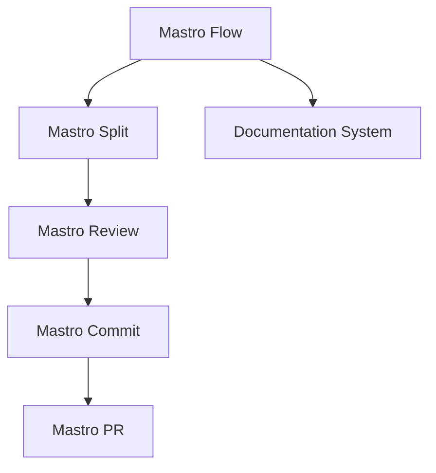
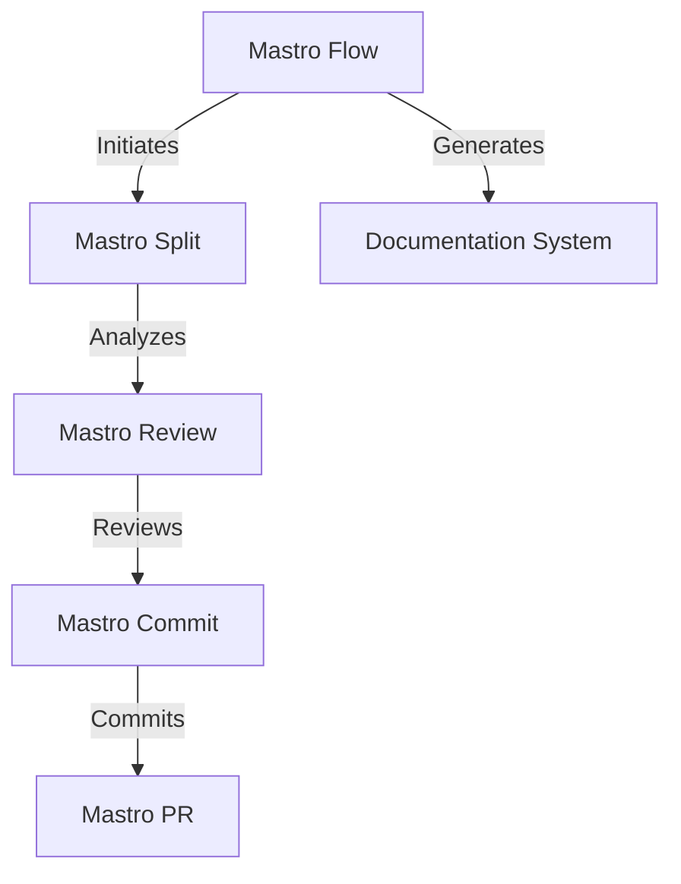
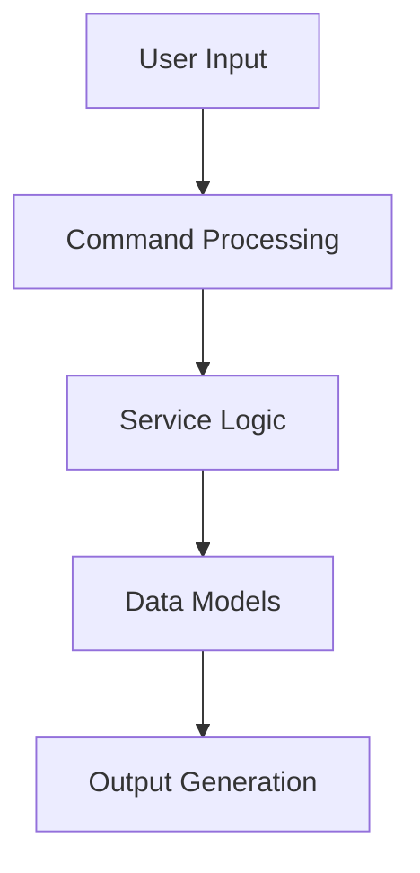

<!---
This file was automatically generated by Mastro CLI
Generated on: 2025-08-12T04:07:41.959Z
Document type: architecture
Title: Architecture Documentation
References: .claude/settings.local.json, lib/commands/config.d.ts, lib/commands/config.js, lib/utils/config.d.ts, lib/utils/config.js, refined-prompts/generative-prompt-2025-08-09T21-33-56-948Z.json, refined-prompts/generative-prompt-2025-08-09T21-38-47-439Z.json, src/commands/config.ts, src/utils/config.ts, bin/dev, bin/run, lib/index.d.ts, lib/index.js, lib/commands/brainstorm.d.ts, lib/commands/brainstorm.js, lib/commands/info.d.ts, lib/commands/info.js, lib/commands/refine.d.ts, lib/commands/refine.js

To prevent this file from being overwritten, add custom content
between the CUSTOM_START and CUSTOM_END markers below.
--->

# Refiner Architecture Documentation

## 1. High-Level System Architecture Overview

The **Refiner** project is an enterprise-level CLI tool built with TypeScript and Node.js, designed to streamline the software development workflow. It integrates various components to facilitate a seamless experience from code review to documentation generation. The architecture is modular, allowing for easy maintenance and scalability.

### Key Components:
- **Mastro CLI**: The core command-line interface that orchestrates the workflow.
- **Mastro Flow**: Manages the complete workflow from splitting commits to generating documentation.
- **Mastro Review**: Provides AI-powered code review capabilities.
- **Mastro Split**: Analyzes commit boundaries intelligently.
- **Mastro Commit**: Generates enhanced commit messages.
- **Mastro PR**: Manages pull requests effectively.
- **Documentation System**: Generates multi-format documentation, including Mermaid diagrams.

## 2. Component Relationships and Data Flow

The components interact in a defined sequence to achieve the desired workflow:

1. **Mastro Flow** initiates the process.
2. **Mastro Split** analyzes the codebase and determines commit boundaries.
3. **Mastro Review** performs code reviews and provides feedback.
4. **Mastro Commit** generates commit messages based on the review.
5. **Mastro PR** creates and manages pull requests.
6. **Documentation System** generates documentation throughout the process.

### Data Flow Diagram



## 3. Design Patterns and Architectural Decisions

### Design Patterns Used:
- **Command Pattern**: Each CLI command is encapsulated as an object, allowing for flexible command execution.
- **Observer Pattern**: Components listen for events and react accordingly, particularly in the workflow orchestration.
- **Factory Pattern**: Used for creating instances of services and commands dynamically.

### Architectural Decisions:
- **Modular Architecture**: Each component is developed as a separate module, promoting separation of concerns and easier testing.
- **Dependency Injection**: Facilitates easier unit testing and decoupling of components.

## 4. Technology Stack and Rationale

- **TypeScript**: Provides type safety and enhances code maintainability.
- **Node.js**: Enables asynchronous processing and is well-suited for CLI applications.
- **Oclif**: A framework for building CLI applications, providing built-in command management and help features.
- **AI Libraries**: Utilized for enhanced code review and validation (e.g., OpenAI, Anthropic AI).

## 5. Directory Structure and Organization

The directory structure is organized to separate source code, documentation, and command definitions clearly:

```
refiner/
├── .claude/                # Source code files
├── bin/                    # CLI entry point
├── docs/                   # Documentation files
├── lib/                    # Library source code
│   ├── commands/           # Command definitions
│   ├── services/           # Business logic
│   ├── templates/          # Templates for messages
│   ├── ui/                 # User interface components
│   └── utils/              # Utility functions
├── refined-prompts/        # Source code files for refined prompts
└── src/                    # Main source code
    ├── commands/           # Command definitions
    └── services/           # Business logic
```

## 6. Module Dependencies and Interfaces

### Key Dependencies:
- **@anthropic-ai/sdk**: For AI functionalities.
- **@oclif/core**: Core CLI functionalities.
- **chalk**: For terminal string styling.
- **dotenv**: For environment variable management.
- **inquirer**: For interactive command-line prompts.

### Interfaces:
Each module exposes a set of interfaces that define the expected behavior, promoting loose coupling and easier testing.

## 7. Data Models and Storage Architecture

Data models are designed to represent the core entities of the application, such as:

- **Commit**: Represents a code commit with associated metadata.
- **Review**: Contains information about code reviews, including comments and validation results.
- **Pull Request**: Represents a pull request with its status and associated commits.

Data is primarily stored in memory during execution, with options for persistent storage in future iterations.

## 8. Security Architecture and Considerations

- **Input Validation**: All user inputs are validated to prevent injection attacks.
- **Environment Variables**: Sensitive information is stored in environment variables and accessed via the `dotenv` library.
- **Access Control**: Implemented through role-based access control for different CLI commands.

## 9. Performance and Scalability Design

- **Asynchronous Processing**: Leveraging Node.js's non-blocking I/O for improved performance.
- **Caching**: Implemented for frequently accessed data to reduce processing time.
- **Load Balancing**: Future enhancements may include distributed processing for handling larger workloads.

## 10. Deployment Architecture

The application is designed to be deployed as a CLI tool, which can be installed globally or locally within a project. Continuous integration and deployment (CI/CD) pipelines are recommended for automated testing and deployment.

### Deployment Steps:
1. Build the application using TypeScript.
2. Package the CLI tool for distribution.
3. Deploy to a package registry (e.g., npm).

## 11. Mermaid Diagrams for Visual Representation

### Component Interaction Diagram



### Data Flow Diagram



---

This documentation serves as a comprehensive guide for both new team members and experienced developers, facilitating a clear understanding of the Refiner project's architecture and enabling informed decisions regarding modifications or extensions.\n\n## System Architecture\n\nHigh-level system architecture overview\n\n```mermaid\nflowchart TD\n        A[Client Application] --> B[API Gateway]\n        B --> C[Business Logic Layer]\n        C --> D[Data Access Layer]\n        D --> E[Database]\n        F[nodejs] --> C\n```\n\n\n\n## Main User Journey Flow\n\nUser flow diagram for Main User Journey\n\n```mermaid\nflowchart TD\n        A[Load Application]\n        B[Navigate]\n        A --> B\n        C[Interact]\n        B --> C\n```\n\n

---

<!-- CUSTOM_START -->
<!-- Add your custom content here - it will be preserved during regeneration -->
<!-- CUSTOM_END -->

*Documentation generated by [Mastro CLI](https://github.com/your-org/mastro) on 8/12/2025*