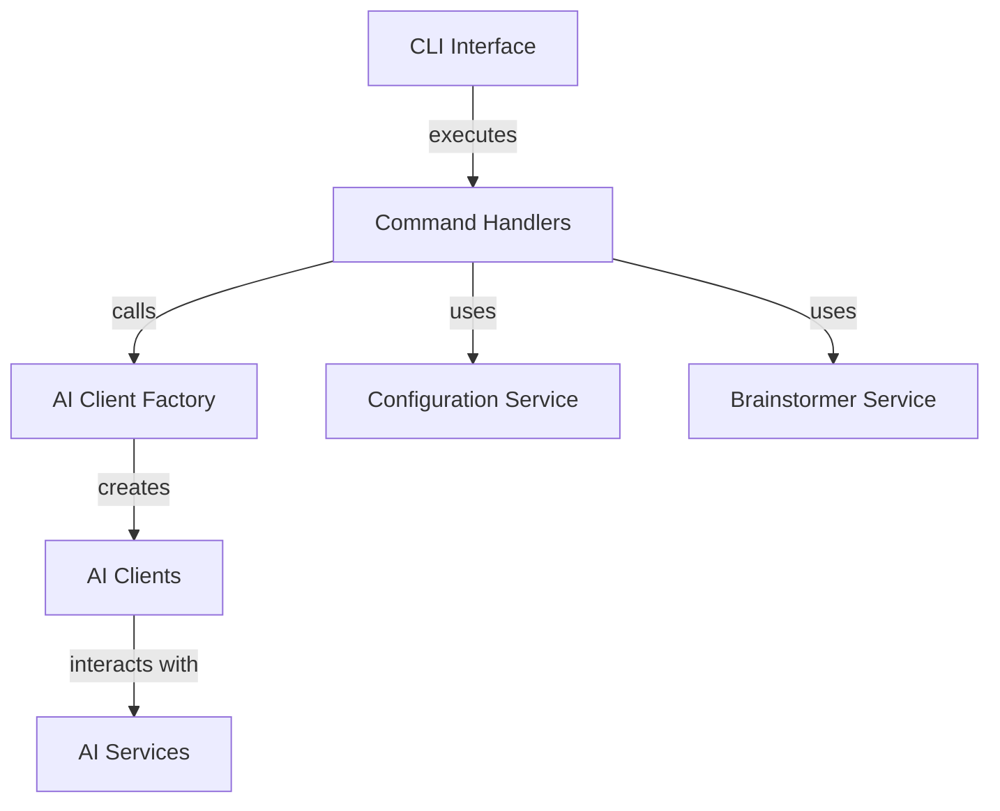
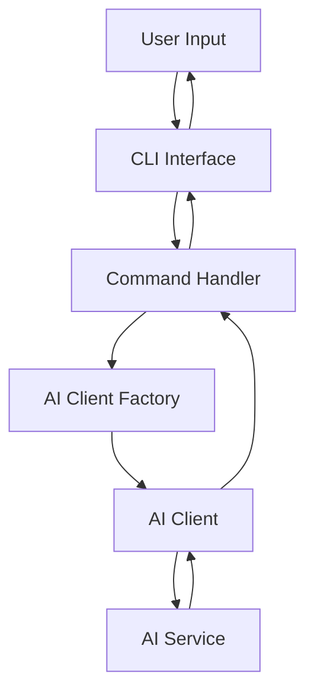
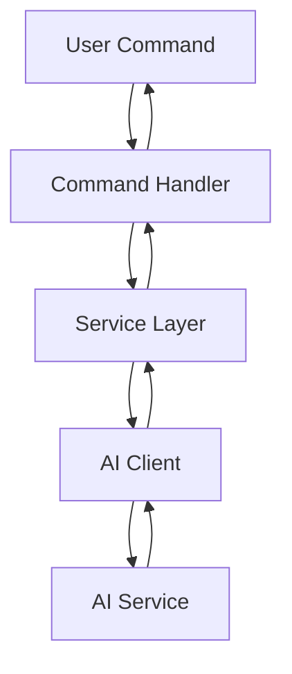

<!---
This file was automatically generated by refiner
Generated on: 2025-08-13T06:02:59.347Z
Document type: architecture
Title: Architecture Documentation
References: .claude/settings.local.json, .mastro/analytics.json, lib/commands/config.d.ts, lib/commands/config.js, lib/utils/config.d.ts, lib/utils/config.js, refined-prompts/generative-prompt-2025-08-09T21-33-56-948Z.json, refined-prompts/generative-prompt-2025-08-09T21-38-47-439Z.json, src/commands/config.ts, src/utils/config.ts, bin/dev, bin/run, lib/index.d.ts, lib/index.js, lib/commands/brainstorm.d.ts, lib/commands/brainstorm.js, lib/commands/info.d.ts, lib/commands/info.js, lib/commands/refine.d.ts, lib/commands/refine.js

To prevent this file from being overwritten, add custom content
between the CUSTOM_START and CUSTOM_END markers below.
--->

# Refiner Architecture Documentation

## 1. High-Level System Architecture Overview

The **Refiner** project is an enterprise-level application built using TypeScript and Node.js. It serves as a command-line interface (CLI) tool that integrates various AI services to facilitate brainstorming and refinement processes. The architecture is modular, allowing for easy extension and maintenance.

### Key Features:
- Command execution through a CLI interface
- Integration with multiple AI service providers
- Configurable settings for user preferences
- Interactive user prompts for enhanced usability

## 2. Component Relationships and Data Flow

The system is composed of several key components that interact with each other to fulfill user commands. Below is a simplified view of the component relationships:



### Data Flow:
1. User inputs a command via the CLI.
2. The command handler processes the input and interacts with the appropriate services.
3. AI clients are instantiated based on the command requirements.
4. Data is sent to AI services, and responses are processed and returned to the user.

## 3. Design Patterns and Architectural Decisions

### Design Patterns:
- **Factory Pattern**: Used in `ai-client-factory.ts` to create instances of AI clients based on user configuration.
- **Command Pattern**: Each command (e.g., `brainstorm`, `refine`) is encapsulated in its own class, allowing for easy addition of new commands.
- **Singleton Pattern**: Configuration service is implemented as a singleton to ensure consistent access to settings across the application.

### Architectural Decisions:
- Modular architecture to promote separation of concerns.
- Use of TypeScript for type safety and improved developer experience.
- CLI-based interface to facilitate quick interactions without a graphical user interface.

## 4. Technology Stack and Rationale

- **TypeScript**: Provides static typing, enhancing code quality and maintainability.
- **Node.js**: Asynchronous event-driven architecture suitable for I/O-bound applications.
- **Oclif**: Framework for building CLI applications, providing built-in command management and help features.
- **AI SDKs**: Various libraries for integrating with AI services (e.g., OpenAI, Anthropic).

## 5. Directory Structure and Organization

The directory structure is organized to facilitate easy navigation and understanding of the codebase:

```
refiner/
├── .claude/
├── .mastro/
├── bin/
├── docs/
├── lib/
│   ├── commands/
│   ├── services/
│   ├── templates/
│   ├── ui/
│   └── utils/
├── refined-prompts/
└── src/
    ├── commands/
    └── services/
```

### Key Directories:
- **src/**: Contains the main source code files.
- **lib/**: Contains reusable libraries and utilities.
- **docs/**: Contains documentation files for the project.

## 6. Module Dependencies and Interfaces

### Key Dependencies:
- **@anthropic-ai/sdk**: For AI interactions.
- **@google/generative-ai**: For generative AI capabilities.
- **@oclif/core**: For CLI command management.
- **chalk**: For terminal string styling.
- **dotenv**: For environment variable management.

### Interfaces:
- Each command module implements a common interface for command execution, ensuring consistency across the application.

## 7. Data Models and Storage Architecture

Data models are primarily in-memory, with configurations stored in a JSON format using the `conf` library. The application does not currently use a persistent database, as it focuses on transient data processing.

### Configuration Model:
```typescript
interface Config {
    apiKey: string;
    model: string;
    preferences: {
        language: string;
        tone: string;
    };
}
```

## 8. Security Architecture and Considerations

- **Environment Variables**: Sensitive information (e.g., API keys) is managed through environment variables using the `dotenv` package.
- **Input Validation**: User inputs are validated to prevent injection attacks and ensure data integrity.
- **Rate Limiting**: Implemented in AI client interactions to avoid exceeding API usage limits.

## 9. Performance and Scalability Design

- **Asynchronous Processing**: Leveraging Node.js's non-blocking I/O model to handle multiple requests concurrently.
- **Caching**: Future implementations may include caching mechanisms for frequently accessed data to improve response times.
- **Load Testing**: Regular load testing to identify bottlenecks and optimize performance.

## 10. Deployment Architecture

The application is designed to be deployed as a CLI tool, which can be packaged and distributed via npm. Continuous integration and deployment (CI/CD) practices should be implemented to automate testing and deployment processes.

### Deployment Steps:
1. Build the application using TypeScript.
2. Package the CLI tool using npm.
3. Deploy to a cloud service or distribute via npm registry.

## 11. Mermaid Diagrams for Visual Representation

### Component Interaction Diagram


### Data Flow Diagram


---

This documentation aims to provide both new team members and experienced developers with a comprehensive understanding of the Refiner project's architecture, enabling informed decisions regarding modifications or extensions.\n\n## System Architecture\n\nHigh-level system architecture overview\n\n```mermaid\nflowchart TD\n        A[Client Application] --> B[API Gateway]\n        B --> C[Business Logic Layer]\n        C --> D[Data Access Layer]\n        D --> E[Database]\n        F[nodejs] --> C\n```\n\n\n\n## Main User Journey Flow\n\nUser flow diagram for Main User Journey\n\n```mermaid\nflowchart TD\n        A[Load Application]\n        B[Navigate]\n        A --> B\n        C[Interact]\n        B --> C\n```\n\n

---

<!-- CUSTOM_START -->
<!-- Add your custom content here - it will be preserved during regeneration -->
<!-- CUSTOM_END -->

*Documentation generated by refiner on 8/13/2025*