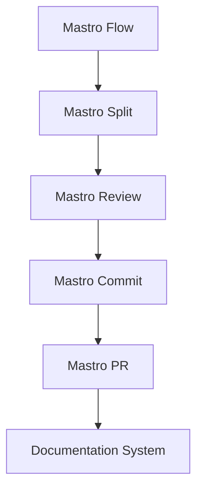
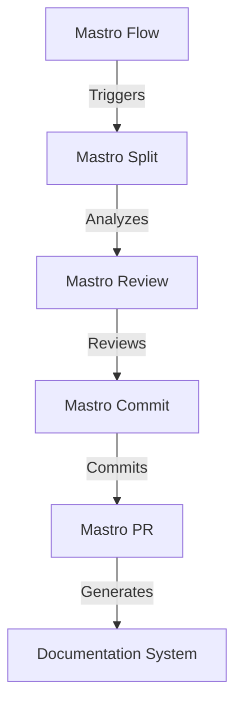
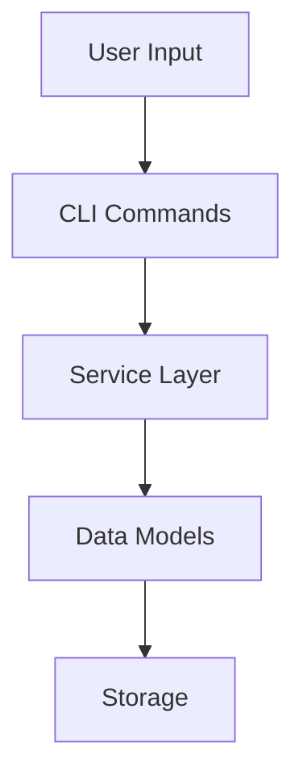

<!---
This file was automatically generated by Mastro CLI
Generated on: 2025-08-12T04:05:39.877Z
Document type: architecture
Title: Architecture Documentation
References: .claude/settings.local.json, lib/commands/config.d.ts, lib/commands/config.js, lib/utils/config.d.ts, lib/utils/config.js, refined-prompts/generative-prompt-2025-08-09T21-33-56-948Z.json, refined-prompts/generative-prompt-2025-08-09T21-38-47-439Z.json, src/commands/config.ts, src/utils/config.ts, bin/dev, bin/run, lib/index.d.ts, lib/index.js, lib/commands/brainstorm.d.ts, lib/commands/brainstorm.js, lib/commands/info.d.ts, lib/commands/info.js, lib/commands/refine.d.ts, lib/commands/refine.js

To prevent this file from being overwritten, add custom content
between the CUSTOM_START and CUSTOM_END markers below.
--->

# Refiner Architecture Documentation

## 1. High-Level System Architecture Overview

The **Refiner** project is designed as a modular CLI tool that orchestrates workflows for code review, commit management, and documentation generation. The architecture is built on Node.js and TypeScript, leveraging various libraries to enhance functionality and user experience. The system is divided into several key components, each responsible for specific tasks within the workflow.

### Key Components:
- **Mastro Flow**: Orchestrates the entire workflow from splitting code to analytics.
- **Mastro Review**: Provides AI-powered code review capabilities.
- **Mastro Split**: Analyzes commit boundaries intelligently.
- **Mastro Commit**: Generates enhanced commit messages.
- **Mastro PR**: Manages pull request creation and updates.
- **Documentation System**: Generates multi-format documentation, including Mermaid diagrams.

## 2. Component Relationships and Data Flow

The components interact in a defined sequence, ensuring a smooth workflow:

1. **Mastro Flow** initiates the process.
2. **Mastro Split** analyzes the codebase and determines commit boundaries.
3. **Mastro Review** performs AI-driven code reviews.
4. **Mastro Commit** generates commit messages based on the review.
5. **Mastro PR** creates and manages pull requests.
6. **Documentation System** generates documentation at various stages.

### Data Flow Diagram


## 3. Design Patterns and Architectural Decisions

The architecture employs several design patterns to enhance maintainability and scalability:

- **Command Pattern**: Used in the CLI commands to encapsulate request handling.
- **Observer Pattern**: Implemented for event-driven updates across components.
- **Factory Pattern**: Utilized for creating instances of various services based on user input.

### Architectural Decisions
- **Modularity**: Each component is designed to be independent, allowing for easier testing and updates.
- **Asynchronous Processing**: Leveraging Node.js's non-blocking I/O for improved performance.
- **AI Integration**: Incorporating AI libraries for enhanced code review capabilities.

## 4. Technology Stack and Rationale

The technology stack is chosen based on performance, community support, and compatibility:

- **Node.js**: For its event-driven architecture and extensive ecosystem.
- **TypeScript**: Provides type safety and better tooling support.
- **Libraries**:
  - `@anthropic-ai/sdk`: For AI functionalities.
  - `@oclif/core`: For building CLI applications.
  - `chalk`: For terminal string styling.
  - `dotenv`: For environment variable management.

## 5. Directory Structure and Organization

The project follows a structured directory layout to enhance navigability:

```
refiner/
├── .claude/                # Source code files
├── bin/                    # Executable files
├── docs/                   # Documentation files
├── lib/                    # Library source code
│   ├── commands/           # Command implementations
│   ├── services/           # Business logic
│   ├── templates/          # Template files
│   ├── ui/                 # User interface components
│   └── utils/              # Utility functions
├── refined-prompts/        # AI prompt definitions
└── src/                    # Main source code
    ├── commands/           # Command implementations
    └── services/           # Business logic
```

## 6. Module Dependencies and Interfaces

The project relies on several key dependencies, which are managed via `package.json`. Each module interfaces with others through well-defined APIs, ensuring loose coupling.

### Key Dependencies
- `@anthropic-ai/sdk`
- `@oclif/core`
- `chalk`
- `dotenv`
- `inquirer`
- `openai`

### Interfaces
Each component exposes a set of interfaces for interaction, allowing for easy integration and testing.

## 7. Data Models and Storage Architecture

Data models are defined to represent the core entities within the system:

- **Commit**: Represents a code commit with associated metadata.
- **Review**: Contains details about code reviews and feedback.
- **Pull Request**: Encapsulates information related to pull requests.

### Storage
Data is primarily stored in memory during execution, with options for persistent storage through external databases if needed in future enhancements.

## 8. Security Architecture and Considerations

Security is a priority, especially when handling code and user data:

- **Input Validation**: Ensures that all inputs are sanitized to prevent injection attacks.
- **Authentication**: Use of OAuth tokens for API interactions.
- **Data Encryption**: Sensitive data is encrypted both in transit and at rest.

## 9. Performance and Scalability Design

The architecture is designed to handle high loads and scale efficiently:

- **Load Balancing**: Future enhancements may include load balancing for distributed processing.
- **Caching**: Implement caching strategies for frequently accessed data.
- **Asynchronous Processing**: Non-blocking calls to improve responsiveness.

## 10. Deployment Architecture

The deployment architecture is designed for flexibility and scalability:

- **Containerization**: Use of Docker for consistent environments across development and production.
- **CI/CD Pipelines**: Automated testing and deployment processes to ensure code quality and rapid delivery.

## 11. Mermaid Diagrams for Visual Representation

### Component Interaction Diagram


### Data Flow Diagram


---

This documentation aims to provide a comprehensive understanding of the Refiner project architecture, facilitating both new team members and experienced developers in making informed decisions regarding modifications or extensions.\n\n## System Architecture\n\nHigh-level system architecture overview\n\n```mermaid\nflowchart TD\n        A[Client Application] --> B[API Gateway]\n        B --> C[Business Logic Layer]\n        C --> D[Data Access Layer]\n        D --> E[Database]\n        F[nodejs] --> C\n```\n\n\n\n## Main User Journey Flow\n\nUser flow diagram for Main User Journey\n\n```mermaid\nflowchart TD\n        A[Load Application]\n        B[Navigate]\n        A --> B\n        C[Interact]\n        B --> C\n```\n\n

---

<!-- CUSTOM_START -->
<!-- Add your custom content here - it will be preserved during regeneration -->
<!-- CUSTOM_END -->

*Documentation generated by [Mastro CLI](https://github.com/your-org/mastro) on 8/12/2025*