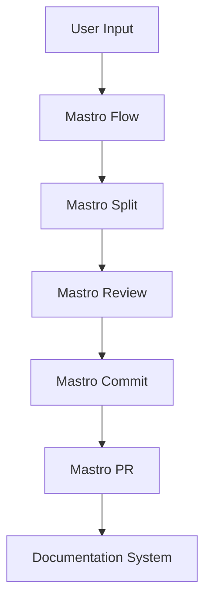
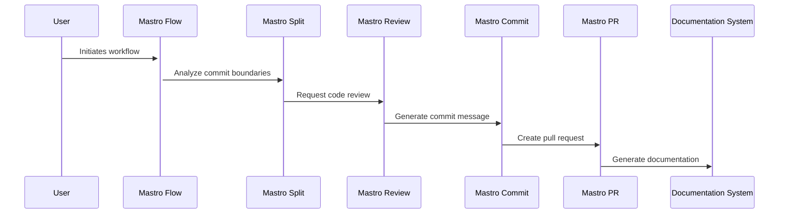

<!---
This file was automatically generated by Mastro CLI
Generated on: 2025-08-12T04:01:37.427Z
Document type: architecture
Title: Architecture Documentation
References: .claude/settings.local.json, lib/commands/config.d.ts, lib/commands/config.js, lib/utils/config.d.ts, lib/utils/config.js, refined-prompts/generative-prompt-2025-08-09T21-33-56-948Z.json, refined-prompts/generative-prompt-2025-08-09T21-38-47-439Z.json, src/commands/config.ts, src/utils/config.ts, bin/dev, bin/run, lib/index.d.ts, lib/index.js, lib/commands/brainstorm.d.ts, lib/commands/brainstorm.js, lib/commands/info.d.ts, lib/commands/info.js, lib/commands/refine.d.ts, lib/commands/refine.js

To prevent this file from being overwritten, add custom content
between the CUSTOM_START and CUSTOM_END markers below.
--->

# Refiner Architecture Documentation

## 1. High-Level System Architecture Overview

The **Refiner** project is a comprehensive CLI tool designed for workflow orchestration, code review, and documentation generation. Built using TypeScript and Node.js, it leverages a modular architecture to facilitate maintainability and scalability. The system is composed of several key components that interact to provide a seamless user experience.

### Key Components
- **Mastro Flow**: Orchestrates the entire workflow from splitting code to analytics.
- **Mastro Review**: Utilizes AI for code review and validation.
- **Mastro Split**: Analyzes commit boundaries intelligently.
- **Mastro Commit**: Generates enhanced commit messages.
- **Mastro PR**: Manages pull requests effectively.
- **Documentation System**: Generates multi-format documentation, including Mermaid diagrams.

## 2. Component Relationships and Data Flow

The components interact in a defined sequence to achieve the desired outcomes. The data flow can be summarized as follows:

1. **User Input**: Commands are issued via the CLI.
2. **Mastro Flow**: Initiates the workflow based on the command.
3. **Mastro Split**: Analyzes the codebase to determine commit boundaries.
4. **Mastro Review**: Performs AI-driven code reviews and provides feedback.
5. **Mastro Commit**: Generates commit messages based on the review.
6. **Mastro PR**: Facilitates the creation and management of pull requests.
7. **Documentation System**: Generates documentation based on the workflow and code changes.

## 3. Design Patterns and Architectural Decisions

### Design Patterns
- **Command Pattern**: Used for encapsulating commands in the CLI, allowing for extensibility.
- **Observer Pattern**: Employed in the Mastro Flow to notify components of state changes.
- **Factory Pattern**: Utilized for creating instances of various services and commands.

### Architectural Decisions
- **Modular Architecture**: Each component is designed as a separate module, promoting separation of concerns.
- **Asynchronous Processing**: Leveraging Node.js's non-blocking I/O for performance.
- **AI Integration**: Incorporating AI for enhanced code review capabilities.

## 4. Technology Stack and Rationale

- **TypeScript**: Provides type safety and better tooling support.
- **Node.js**: Enables asynchronous processing and is well-suited for CLI applications.
- **Oclif**: A framework for building command-line tools, providing a robust CLI structure.
- **AI Libraries**: Such as `@anthropic-ai/sdk` and `openai` for intelligent features.

## 5. Directory Structure and Organization

The project follows a structured directory layout to enhance navigability:

```
refiner/
├── .claude/               # Source code files
├── bin/                   # CLI entry point
├── docs/                  # Documentation files
├── lib/                   # Library source code
│   ├── commands/          # Command implementations
│   ├── services/          # Business logic
│   ├── templates/         # Templates for output
│   ├── ui/                # User interface components
│   └── utils/             # Utility functions
├── refined-prompts/       # Source code files for refined prompts
└── src/                   # Main source code
    ├── commands/          # Command implementations
    └── services/          # Business logic
```

## 6. Module Dependencies and Interfaces

### Key Dependencies
- `@anthropic-ai/sdk`: For AI functionalities.
- `@oclif/core`: Core CLI functionalities.
- `chalk`: For terminal string styling.
- `dotenv`: For environment variable management.
- `inquirer`: For interactive command-line prompts.

### Interfaces
Each module exposes a set of interfaces that define the expected behavior, promoting loose coupling and easier testing.

## 7. Data Models and Storage Architecture

Data models are defined using TypeScript interfaces, ensuring type safety. The storage architecture is primarily in-memory, with the potential for future integration with databases for persistent storage.

### Example Data Model
```typescript
interface Commit {
    id: string;
    message: string;
    author: string;
    timestamp: Date;
}
```

## 8. Security Architecture and Considerations

Security is a priority, especially when handling user data and integrating with external APIs. Key considerations include:

- **Input Validation**: Ensuring all user inputs are validated to prevent injection attacks.
- **Environment Variables**: Sensitive information is stored in environment variables and accessed via `dotenv`.
- **Rate Limiting**: Implementing rate limiting for API calls to prevent abuse.

## 9. Performance and Scalability Design

The architecture is designed for performance and scalability:

- **Asynchronous Operations**: Non-blocking I/O operations to handle multiple requests efficiently.
- **Load Distribution**: Future plans to implement load balancing for distributed processing.
- **Caching**: Consideration for caching frequently accessed data to reduce latency.

## 10. Deployment Architecture

The deployment architecture is designed to be flexible, allowing for various environments (development, staging, production). Key aspects include:

- **Containerization**: Using Docker for consistent deployment across environments.
- **CI/CD Integration**: Automated testing and deployment pipelines to streamline updates.

## 11. Mermaid Diagrams for Visual Representation

### System Overview Diagram


### Component Interaction Diagram


---

This documentation aims to provide a comprehensive understanding of the Refiner project architecture, facilitating both new team members and experienced developers in making informed decisions regarding modifications or extensions.\n\n## System Architecture\n\nHigh-level system architecture overview\n\n```mermaid\nflowchart TD\n        A[Client Application] --> B[API Gateway]\n        B --> C[Business Logic Layer]\n        C --> D[Data Access Layer]\n        D --> E[Database]\n        F[nodejs] --> C\n```\n\n\n\n## Main User Journey Flow\n\nUser flow diagram for Main User Journey\n\n```mermaid\nflowchart TD\n        A[Load Application]\n        B[Navigate]\n        A --> B\n        C[Interact]\n        B --> C\n```\n\n

---

<!-- CUSTOM_START -->
<!-- Add your custom content here - it will be preserved during regeneration -->
<!-- CUSTOM_END -->

*Documentation generated by [Mastro CLI](https://github.com/your-org/mastro) on 8/12/2025*