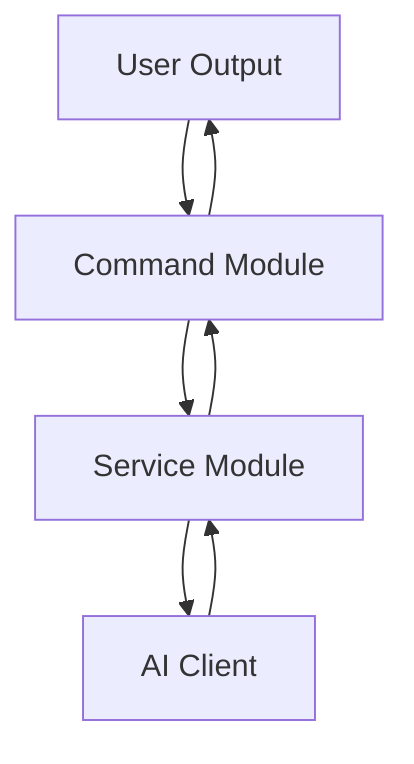
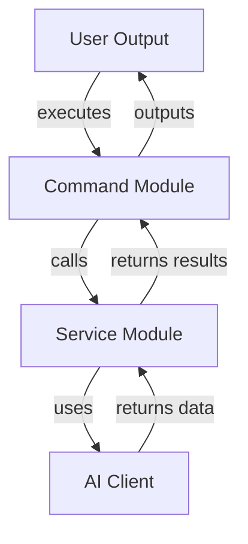
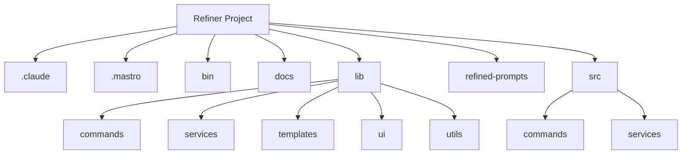

<!---
This file was automatically generated by refiner
Generated on: 2025-08-13T05:54:16.279Z
Document type: architecture
Title: Architecture Documentation
References: .claude/settings.local.json, .mastro/analytics.json, lib/commands/config.d.ts, lib/commands/config.js, lib/utils/config.d.ts, lib/utils/config.js, refined-prompts/generative-prompt-2025-08-09T21-33-56-948Z.json, refined-prompts/generative-prompt-2025-08-09T21-38-47-439Z.json, src/commands/config.ts, src/utils/config.ts, bin/dev, bin/run, lib/index.d.ts, lib/index.js, lib/commands/brainstorm.d.ts, lib/commands/brainstorm.js, lib/commands/info.d.ts, lib/commands/info.js, lib/commands/refine.d.ts, lib/commands/refine.js

To prevent this file from being overwritten, add custom content
between the CUSTOM_START and CUSTOM_END markers below.
--->

# Refiner Architecture Documentation

## 1. High-Level System Architecture Overview

The **Refiner** project is an enterprise-level application built using **TypeScript** and **Node.js**. It serves as a command-line interface (CLI) tool that leverages AI capabilities to assist users in brainstorming and refining ideas. The architecture is modular, allowing for easy extension and maintenance.

### Key Features:
- Command execution via CLI
- Integration with multiple AI services
- User-friendly prompts and configurations

## 2. Component Relationships and Data Flow

The system is composed of several key components that interact with each other to fulfill user commands. The primary components include:

- **Commands**: Each command (e.g., `brainstorm`, `config`, `info`, `refine`) is implemented as a separate module under `src/commands/`.
- **Services**: Core business logic is encapsulated in service modules (e.g., `ai-client`, `brainstormer`).
- **AI Clients**: Interfaces with various AI service providers to fetch data and perform operations.

### Data Flow:
1. User inputs a command via CLI.
2. The corresponding command module processes the input.
3. The command module may call one or more services to perform the required operations.
4. Results are returned to the user through the CLI.



## 3. Design Patterns and Architectural Decisions

### Design Patterns:
- **Command Pattern**: Each command is encapsulated in its own class, allowing for easy addition of new commands.
- **Factory Pattern**: The `ai-client-factory` module creates instances of different AI clients based on configuration.
- **Singleton Pattern**: Configuration settings are loaded once and reused throughout the application.

### Architectural Decisions:
- Modular design for separation of concerns.
- Use of TypeScript for type safety and better maintainability.
- CLI-based interaction for simplicity and ease of use.

## 4. Technology Stack and Rationale

- **TypeScript**: Provides static typing, enhancing code quality and maintainability.
- **Node.js**: Asynchronous, event-driven architecture suitable for I/O-bound applications.
- **Oclif**: A framework for building CLI applications, providing built-in command handling and help features.
- **AI SDKs**: Integration with various AI services (e.g., OpenAI, Anthropic) to leverage advanced capabilities.

## 5. Directory Structure and Organization

The project follows a structured directory layout to enhance readability and maintainability:

```
refiner/
├── .claude/
├── .mastro/
├── bin/
├── docs/
├── lib/
│   ├── commands/
│   ├── services/
│   ├── templates/
│   ├── ui/
│   └── utils/
├── refined-prompts/
└── src/
    ├── commands/
    └── services/
```

- **src/**: Contains the main application code.
- **lib/**: Holds reusable libraries and utilities.
- **docs/**: Documentation files for developers and users.

## 6. Module Dependencies and Interfaces

### Key Dependencies:
- `@anthropic-ai/sdk`
- `@google/generative-ai`
- `@oclif/core`
- `chalk`
- `dotenv`

### Interfaces:
Each service and command module defines clear interfaces for interaction, ensuring loose coupling and easier testing.

## 7. Data Models and Storage Architecture

The application primarily operates in-memory and does not utilize a traditional database. Configuration settings are stored using the `conf` library, allowing for persistent storage of user preferences.

### Data Models:
- **Configuration**: Holds user-defined settings.
- **Prompt**: Represents user inputs for brainstorming and refinement.

## 8. Security Architecture and Considerations

- **Environment Variables**: Sensitive information (e.g., API keys) is managed using the `dotenv` library.
- **Input Validation**: All user inputs are validated to prevent injection attacks and ensure data integrity.

## 9. Performance and Scalability Design

- **Asynchronous Processing**: Leveraging Node.js's asynchronous capabilities to handle multiple requests efficiently.
- **Caching**: Consider implementing caching strategies for frequently accessed data to improve performance.

## 10. Deployment Architecture

The application can be deployed as a standalone CLI tool. It can be packaged using tools like `npm` for distribution. Continuous integration and deployment (CI/CD) practices are recommended for maintaining code quality and deployment efficiency.

## 11. Mermaid Diagrams for Visual Representation

### Component Interaction Diagram



### Directory Structure Diagram



---

This documentation serves as a comprehensive guide for both new team members and experienced developers, facilitating a clear understanding of the Refiner project's architecture and design principles.\n\n## System Architecture\n\nHigh-level system architecture overview\n\n```mermaid\nflowchart TD\n        A[Client Application] --> B[API Gateway]\n        B --> C[Business Logic Layer]\n        C --> D[Data Access Layer]\n        D --> E[Database]\n        F[nodejs] --> C\n```\n\n\n\n## Main User Journey Flow\n\nUser flow diagram for Main User Journey\n\n```mermaid\nflowchart TD\n        A[Load Application]\n        B[Navigate]\n        A --> B\n        C[Interact]\n        B --> C\n```\n\n

---

<!-- CUSTOM_START -->
<!-- Add your custom content here - it will be preserved during regeneration -->
<!-- CUSTOM_END -->

*Documentation generated by refiner on 8/13/2025*