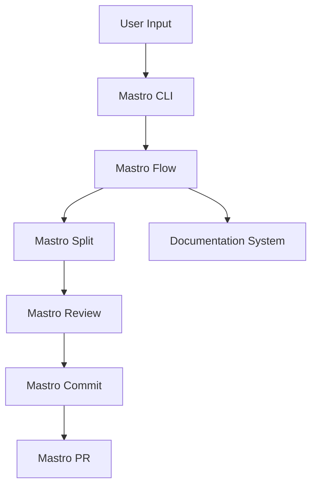
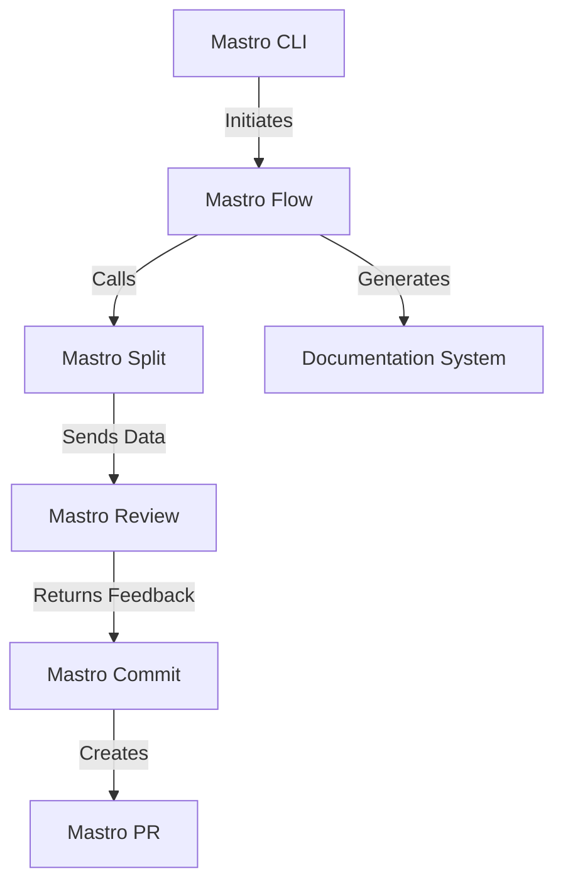
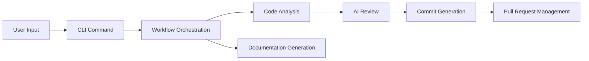

<!---
This file was automatically generated by Mastro CLI
Generated on: 2025-08-12T04:03:34.683Z
Document type: architecture
Title: Architecture Documentation
References: .claude/settings.local.json, lib/commands/config.d.ts, lib/commands/config.js, lib/utils/config.d.ts, lib/utils/config.js, refined-prompts/generative-prompt-2025-08-09T21-33-56-948Z.json, refined-prompts/generative-prompt-2025-08-09T21-38-47-439Z.json, src/commands/config.ts, src/utils/config.ts, bin/dev, bin/run, lib/index.d.ts, lib/index.js, lib/commands/brainstorm.d.ts, lib/commands/brainstorm.js, lib/commands/info.d.ts, lib/commands/info.js, lib/commands/refine.d.ts, lib/commands/refine.js

To prevent this file from being overwritten, add custom content
between the CUSTOM_START and CUSTOM_END markers below.
--->

# Refiner Architecture Documentation

## 1. High-Level System Architecture Overview

The **Refiner** project is designed to streamline and enhance the software development workflow through a series of interconnected components. The architecture is modular, allowing for easy extension and maintenance. The primary components include:

- **Mastro CLI**: The command-line interface that orchestrates the workflow.
- **Mastro Flow**: Manages the entire workflow from splitting code to analytics.
- **Mastro Review**: Provides AI-powered code review capabilities.
- **Mastro Split**: Analyzes commit boundaries intelligently.
- **Mastro Commit**: Generates enhanced commit messages.
- **Mastro PR**: Facilitates pull request creation and management.
- **Documentation System**: Generates multi-format documentation, including Mermaid diagrams.

## 2. Component Relationships and Data Flow

The components interact in a defined sequence, as illustrated below:

1. **User Input**: The user initiates a command via the Mastro CLI.
2. **Mastro Flow**: Orchestrates the workflow, invoking Mastro Split, Review, Commit, and PR components as needed.
3. **Mastro Split**: Analyzes the codebase and determines commit boundaries.
4. **Mastro Review**: Validates code changes using AI, providing feedback.
5. **Mastro Commit**: Generates commit messages based on the review.
6. **Mastro PR**: Creates and manages pull requests based on commits.
7. **Documentation System**: Generates documentation throughout the workflow.



## 3. Design Patterns and Architectural Decisions

The architecture employs several design patterns:

- **Command Pattern**: Each CLI command is encapsulated as an object, allowing for easy extension and modification.
- **Observer Pattern**: Components can subscribe to events, enabling decoupled communication.
- **Factory Pattern**: Used for creating instances of various services, promoting loose coupling.

### Architectural Decisions

- **Modularity**: Each component is designed to be independent, facilitating easier testing and maintenance.
- **AI Integration**: Leveraging AI for code review enhances the quality of feedback and reduces manual effort.
- **Documentation Generation**: Built-in capabilities for generating documentation ensure that the system remains well-documented.

## 4. Technology Stack and Rationale

The project is built using the following technologies:

- **TypeScript**: Provides type safety and improved developer experience.
- **Node.js**: Enables asynchronous processing and efficient handling of I/O operations.
- **Oclif**: A framework for building command-line interfaces, allowing for easy command management.
- **Chalk**: For terminal string styling, enhancing user experience.
- **OpenAI SDK**: For AI-powered features in code review.

### Rationale

The chosen stack supports rapid development, scalability, and maintainability, aligning with enterprise-level requirements.

## 5. Directory Structure and Organization

The directory structure is organized to facilitate easy navigation and understanding:

```
refiner/
├── .claude/               # Source code files
├── bin/                   # Executable files
├── docs/                  # Documentation files
├── lib/                   # Library source code
│   ├── commands/          # Command implementations
│   ├── services/          # Business logic
│   ├── templates/         # Templates for various outputs
│   ├── ui/                # User interface components
│   └── utils/             # Utility functions
├── refined-prompts/       # Source code for refined prompts
└── src/                   # Main source code
    ├── commands/          # Command implementations
    └── services/          # Business logic
```

## 6. Module Dependencies and Interfaces

Key dependencies include:

- **@anthropic-ai/sdk**: For AI functionalities.
- **@oclif/core**: Core CLI functionalities.
- **chalk**: For styling CLI output.
- **dotenv**: For environment variable management.

### Interfaces

Each module exposes a clear interface, allowing other components to interact without needing to understand internal implementations.

## 7. Data Models and Storage Architecture

Data models are designed to represent the entities involved in the workflow:

- **Commit**: Represents a code change with metadata.
- **Review**: Contains feedback and validation results.
- **Pull Request**: Represents a request to merge changes.

### Storage

Data is primarily stored in memory during execution, with options for persistent storage via external databases if required.

## 8. Security Architecture and Considerations

Security is a critical aspect of the Refiner project:

- **Input Validation**: All user inputs are validated to prevent injection attacks.
- **Environment Variables**: Sensitive information is stored in environment variables, not hard-coded.
- **Access Control**: Implemented at the CLI level to restrict command access based on user roles.

## 9. Performance and Scalability Design

The architecture is designed for performance and scalability:

- **Asynchronous Processing**: Leveraging Node.js's non-blocking I/O for efficient execution.
- **Modular Components**: Each component can be scaled independently based on demand.
- **Caching**: Implement caching strategies for frequently accessed data to improve response times.

## 10. Deployment Architecture

The deployment architecture is designed to support various environments (development, staging, production):

- **Containerization**: Using Docker to encapsulate the application and its dependencies.
- **CI/CD Pipeline**: Automated testing and deployment processes to ensure code quality and rapid delivery.
- **Cloud Deployment**: Options for deploying on cloud platforms (e.g., AWS, Azure) for scalability.

## 11. Mermaid Diagrams for Visual Representation

### Component Interaction Diagram



### Data Flow Diagram



---

This documentation serves as a comprehensive guide for both new team members and experienced developers, providing insights into the architecture, design decisions, and operational considerations of the Refiner project.\n\n## System Architecture\n\nHigh-level system architecture overview\n\n```mermaid\nflowchart TD\n        A[Client Application] --> B[API Gateway]\n        B --> C[Business Logic Layer]\n        C --> D[Data Access Layer]\n        D --> E[Database]\n        F[nodejs] --> C\n```\n\n\n\n## Main User Journey Flow\n\nUser flow diagram for Main User Journey\n\n```mermaid\nflowchart TD\n        A[Load Application]\n        B[Navigate]\n        A --> B\n        C[Interact]\n        B --> C\n```\n\n

---

<!-- CUSTOM_START -->
<!-- Add your custom content here - it will be preserved during regeneration -->
<!-- CUSTOM_END -->

*Documentation generated by [Mastro CLI](https://github.com/your-org/mastro) on 8/12/2025*