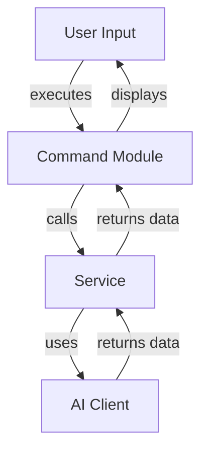
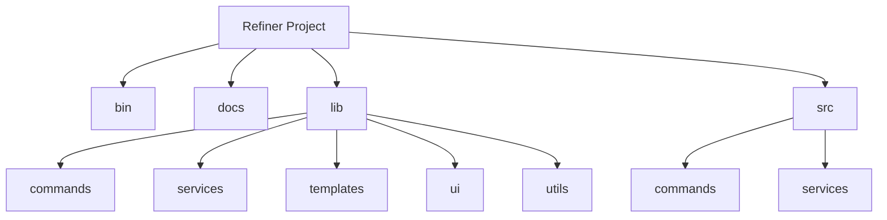

<!---
This file was automatically generated by refiner
Generated on: 2025-08-13T05:51:32.700Z
Document type: architecture
Title: Architecture Documentation
References: .claude/settings.local.json, .mastro/analytics.json, lib/commands/config.d.ts, lib/commands/config.js, lib/utils/config.d.ts, lib/utils/config.js, refined-prompts/generative-prompt-2025-08-09T21-33-56-948Z.json, refined-prompts/generative-prompt-2025-08-09T21-38-47-439Z.json, src/commands/config.ts, src/utils/config.ts, bin/dev, bin/run, lib/index.d.ts, lib/index.js, lib/commands/brainstorm.d.ts, lib/commands/brainstorm.js, lib/commands/info.d.ts, lib/commands/info.js, lib/commands/refine.d.ts, lib/commands/refine.js

To prevent this file from being overwritten, add custom content
between the CUSTOM_START and CUSTOM_END markers below.
--->

# Refiner Architecture Documentation

## 1. High-Level System Architecture Overview

The **Refiner** project is an enterprise-level application built using TypeScript and Node.js. It serves as a command-line interface (CLI) tool that leverages various AI services to facilitate brainstorming, configuration, and information retrieval. The architecture is designed to be modular, allowing for easy extension and maintenance.

### Key Features:
- Command execution via Oclif framework
- Integration with multiple AI services
- User-friendly CLI with interactive prompts

## 2. Component Relationships and Data Flow

The system is composed of several key components that interact with each other to fulfill user commands. The primary components include:

- **Commands**: Each command (e.g., `brainstorm`, `config`, `info`, `refine`) is implemented as a separate module under `src/commands`.
- **Services**: Core business logic and AI interactions are handled by services located in `src/services`.
- **AI Clients**: Specific implementations for different AI providers are encapsulated in `ai-client.ts` and `ai-client-factory.ts`.

### Data Flow:
1. User inputs a command via the CLI.
2. The corresponding command module processes the input and invokes the necessary services.
3. Services interact with AI clients to fetch or process data.
4. Results are returned to the command module and displayed to the user.

## 3. Design Patterns and Architectural Decisions

### Design Patterns:
- **Factory Pattern**: Used in `ai-client-factory.ts` to create instances of AI clients based on configuration.
- **Command Pattern**: Each command is encapsulated in its own class, allowing for easy addition of new commands.

### Architectural Decisions:
- Modular design to promote separation of concerns.
- Use of Oclif for command management to leverage existing CLI capabilities.
- Dependency injection for AI clients to facilitate testing and flexibility.

## 4. Technology Stack and Rationale

- **TypeScript**: Provides type safety and better tooling support.
- **Node.js**: Asynchronous I/O model suitable for CLI applications.
- **Oclif**: Framework for building CLI applications, enabling easy command management.
- **AI SDKs**: Integration with various AI services (e.g., OpenAI, Anthropic) for diverse functionalities.

## 5. Directory Structure and Organization

```plaintext
refiner/
├── .claude/
├── .mastro/
├── bin/
├── docs/
├── lib/
│   ├── commands/
│   ├── services/
│   ├── templates/
│   ├── ui/
│   └── utils/
├── refined-prompts/
└── src/
    ├── commands/
    │   ├── brainstorm.ts
    │   ├── config.ts
    │   ├── info.ts
    │   └── refine.ts
    └── services/
        ├── ai-client-factory.ts
        ├── ai-client.ts
        └── brainstormer.ts
```

## 6. Module Dependencies and Interfaces

### Key Dependencies:
- **@anthropic-ai/sdk**: For AI interactions.
- **@google/generative-ai**: For generative AI functionalities.
- **@oclif/core**: Core CLI framework.
- **chalk**: For terminal string styling.
- **dotenv**: For environment variable management.

### Interfaces:
- Each service exposes a clear interface for interaction, ensuring that commands can operate independently of the underlying implementation.

## 7. Data Models and Storage Architecture

Data models are primarily transient, as the application interacts with external AI services. However, configurations and user preferences can be stored using the `conf` library.

### Example Configuration Model:
```typescript
interface UserConfig {
    apiKey: string;
    preferredAI: string;
}
```

## 8. Security Architecture and Considerations

- **Environment Variables**: Sensitive information (e.g., API keys) is managed using the `dotenv` library to avoid hardcoding.
- **Input Validation**: Commands validate user inputs to prevent injection attacks and ensure data integrity.

## 9. Performance and Scalability Design

- **Asynchronous Processing**: Leveraging Node.js's non-blocking I/O to handle multiple requests efficiently.
- **Modular Services**: Each service can be scaled independently based on demand.

## 10. Deployment Architecture

The application can be deployed as a standalone CLI tool. It can be packaged using tools like `pkg` or Docker for distribution. Continuous integration and deployment (CI/CD) practices should be implemented to automate testing and deployment.

## 11. Mermaid Diagrams for Visual Representation

### Component Interaction Diagram


### Directory Structure Diagram


---

This documentation aims to provide a comprehensive understanding of the Refiner project architecture, facilitating both onboarding for new team members and informed decision-making for experienced developers.\n\n## System Architecture\n\nHigh-level system architecture overview\n\n```mermaid\nflowchart TD\n        A[Client Application] --> B[API Gateway]\n        B --> C[Business Logic Layer]\n        C --> D[Data Access Layer]\n        D --> E[Database]\n        F[nodejs] --> C\n```\n\n\n\n## Main User Journey Flow\n\nUser flow diagram for Main User Journey\n\n```mermaid\nflowchart TD\n        A[Load Application]\n        B[Navigate]\n        A --> B\n        C[Interact]\n        B --> C\n```\n\n

---

<!-- CUSTOM_START -->
<!-- Add your custom content here - it will be preserved during regeneration -->
<!-- CUSTOM_END -->

*Documentation generated by refiner on 8/13/2025*