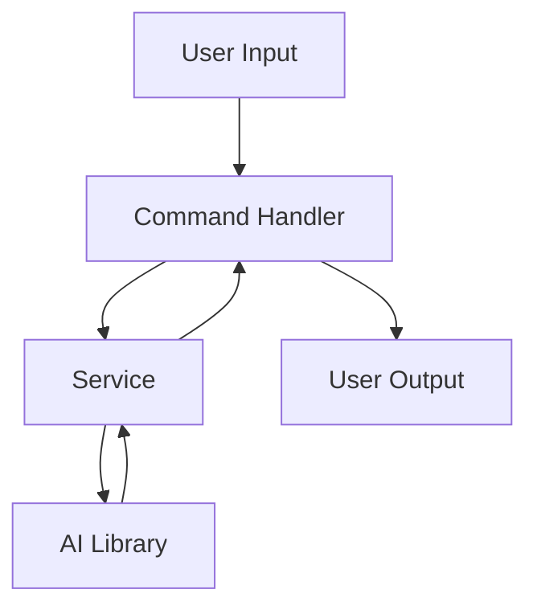
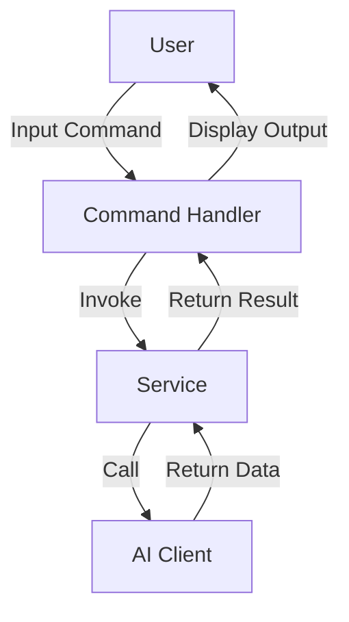
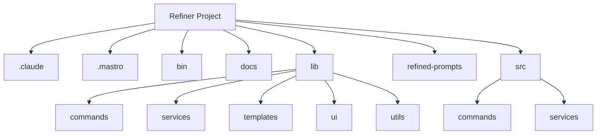

<!---
This file was automatically generated by refiner
Generated on: 2025-08-13T05:58:30.629Z
Document type: architecture
Title: Architecture Documentation
References: .claude/settings.local.json, .mastro/analytics.json, lib/commands/config.d.ts, lib/commands/config.js, lib/utils/config.d.ts, lib/utils/config.js, refined-prompts/generative-prompt-2025-08-09T21-33-56-948Z.json, refined-prompts/generative-prompt-2025-08-09T21-38-47-439Z.json, src/commands/config.ts, src/utils/config.ts, bin/dev, bin/run, lib/index.d.ts, lib/index.js, lib/commands/brainstorm.d.ts, lib/commands/brainstorm.js, lib/commands/info.d.ts, lib/commands/info.js, lib/commands/refine.d.ts, lib/commands/refine.js

To prevent this file from being overwritten, add custom content
between the CUSTOM_START and CUSTOM_END markers below.
--->

# Refiner Architecture Documentation

## 1. High-Level System Architecture Overview

The **Refiner** project is an enterprise-level application built using TypeScript and Node.js. It serves as a command-line interface (CLI) tool that leverages various AI services to facilitate brainstorming and refinement processes. The architecture is designed to be modular, allowing for easy extension and maintenance.

### Key Features:
- Command execution via CLI
- Integration with multiple AI services
- Configurable settings for user preferences
- User-friendly prompts and interactions

## 2. Component Relationships and Data Flow

The system is composed of several key components that interact with each other to fulfill user commands. The main components include:

- **Commands**: Handle user input and execute corresponding actions.
- **Services**: Interact with external AI libraries and manage business logic.
- **Utilities**: Provide helper functions for various tasks.

### Data Flow:
1. User inputs a command via the CLI.
2. The command handler processes the input and delegates tasks to the appropriate service.
3. Services interact with external AI libraries to perform tasks.
4. Results are returned to the command handler and displayed to the user.



## 3. Design Patterns and Architectural Decisions

### Design Patterns Used:
- **Command Pattern**: Each command is encapsulated in its own class, allowing for easy addition of new commands.
- **Factory Pattern**: The `ai-client-factory.ts` creates instances of different AI clients based on configuration.
- **Singleton Pattern**: Configuration settings are managed as a singleton to ensure consistent access across the application.

### Architectural Decisions:
- Modular design to promote separation of concerns.
- Use of TypeScript for type safety and improved maintainability.
- CLI framework (Oclif) for command management and user interaction.

## 4. Technology Stack and Rationale

- **TypeScript**: Provides static typing, enhancing code quality and maintainability.
- **Node.js**: Asynchronous event-driven architecture suitable for I/O-bound applications.
- **Oclif**: A framework for building CLI applications, simplifying command management.
- **AI Libraries**: Integration with various AI SDKs (Anthropic, Google, OpenAI) to leverage advanced capabilities.

## 5. Directory Structure and Organization

The project follows a structured directory layout to enhance clarity and organization:

```
refiner/
├── .claude/
├── .mastro/
├── bin/
├── docs/
├── lib/
│   ├── commands/
│   ├── services/
│   ├── templates/
│   ├── ui/
│   └── utils/
├── refined-prompts/
└── src/
    ├── commands/
    └── services/
```

### Key Directories:
- **src/**: Contains the main source code.
- **lib/**: Contains additional libraries and utilities.
- **docs/**: Contains documentation files.

## 6. Module Dependencies and Interfaces

### Key Dependencies:
- **@anthropic-ai/sdk**: For AI interactions.
- **@google/generative-ai**: For generative AI capabilities.
- **@oclif/core**: For command-line interface functionalities.
- **chalk**: For colorful terminal output.
- **dotenv**: For environment variable management.

### Interfaces:
- Each command module implements a common interface for consistency.
- Services define interfaces for interaction with AI clients.

## 7. Data Models and Storage Architecture

The application primarily operates in memory and does not require a persistent storage layer. However, configuration settings are stored using the `conf` library, allowing for easy retrieval and updates.

### Configuration Model:
- User preferences and settings are stored in a JSON format.

## 8. Security Architecture and Considerations

- **Environment Variables**: Sensitive information (API keys) is managed using environment variables.
- **Input Validation**: User inputs are validated to prevent injection attacks.
- **Rate Limiting**: Implemented in AI service interactions to prevent abuse.

## 9. Performance and Scalability Design

- **Asynchronous Processing**: Node.js's non-blocking I/O model allows for high concurrency.
- **Caching**: Consider implementing caching strategies for frequently accessed data to improve performance.
- **Load Testing**: Regular load testing to identify bottlenecks and optimize performance.

## 10. Deployment Architecture

The application is designed to be deployed in a cloud environment, leveraging CI/CD pipelines for automated deployment. Docker can be used to containerize the application for consistent environments.

### Deployment Steps:
1. Build the application using TypeScript.
2. Run tests to ensure stability.
3. Deploy to a cloud service (e.g., AWS, Azure).

## 11. Mermaid Diagrams for Visual Representation

### Component Interaction Diagram



### Directory Structure Diagram



---

This documentation aims to provide both new team members and experienced developers with a comprehensive understanding of the Refiner project's architecture, enabling informed decisions regarding modifications or extensions.\n\n## System Architecture\n\nHigh-level system architecture overview\n\n```mermaid\nflowchart TD\n        A[Client Application] --> B[API Gateway]\n        B --> C[Business Logic Layer]\n        C --> D[Data Access Layer]\n        D --> E[Database]\n        F[nodejs] --> C\n```\n\n\n\n## Main User Journey Flow\n\nUser flow diagram for Main User Journey\n\n```mermaid\nflowchart TD\n        A[Load Application]\n        B[Navigate]\n        A --> B\n        C[Interact]\n        B --> C\n```\n\n

---

<!-- CUSTOM_START -->
<!-- Add your custom content here - it will be preserved during regeneration -->
<!-- CUSTOM_END -->

*Documentation generated by refiner on 8/13/2025*