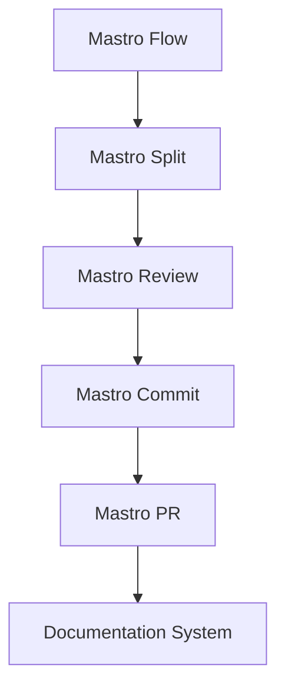
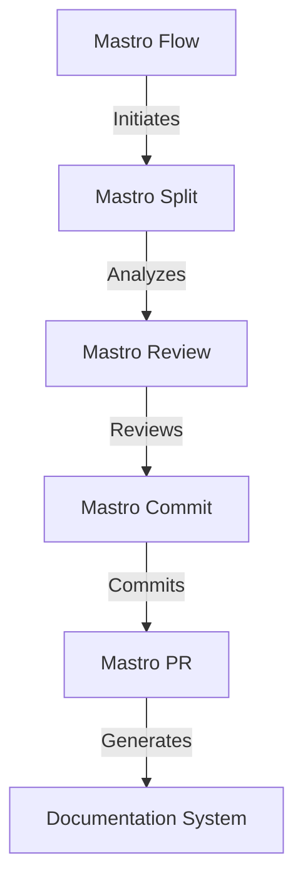
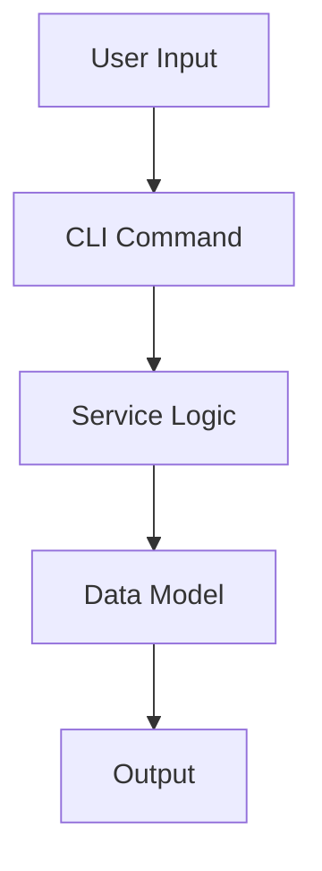

<!---
This file was automatically generated by Mastro CLI
Generated on: 2025-08-12T18:54:24.413Z
Document type: architecture
Title: Architecture Documentation
References: .claude/settings.local.json, .mastro/analytics.json, lib/commands/config.d.ts, lib/commands/config.js, lib/utils/config.d.ts, lib/utils/config.js, refined-prompts/generative-prompt-2025-08-09T21-33-56-948Z.json, refined-prompts/generative-prompt-2025-08-09T21-38-47-439Z.json, src/commands/config.ts, src/utils/config.ts, bin/dev, bin/run, lib/index.d.ts, lib/index.js, lib/commands/brainstorm.d.ts, lib/commands/brainstorm.js, lib/commands/info.d.ts, lib/commands/info.js, lib/commands/refine.d.ts, lib/commands/refine.js

To prevent this file from being overwritten, add custom content
between the CUSTOM_START and CUSTOM_END markers below.
--->

# Refiner Architecture Documentation

## 1. High-Level System Architecture Overview

The **Refiner** project is an enterprise-level CLI tool built using TypeScript and Node.js, designed to streamline workflow orchestration, code review, commit management, and documentation generation. The architecture is modular, allowing for easy extension and maintenance. The system is composed of several key components, each responsible for distinct functionalities within the workflow.

### Key Components:
- **Mastro Flow**: Orchestrates the entire workflow from splitting code to analytics.
- **Mastro Review**: Provides AI-powered code review capabilities.
- **Mastro Split**: Analyzes commit boundaries intelligently.
- **Mastro Commit**: Generates enhanced commit messages.
- **Mastro PR**: Manages pull requests effectively.
- **Documentation System**: Generates multi-format documentation, including Mermaid diagrams.

## 2. Component Relationships and Data Flow

The components interact in a defined sequence, facilitating a smooth workflow:

1. **Mastro Flow** initiates the process.
2. **Mastro Split** analyzes the code and determines commit boundaries.
3. **Mastro Review** performs AI-driven code reviews.
4. **Mastro Commit** generates commit messages based on the review.
5. **Mastro PR** creates and manages pull requests.
6. The **Documentation System** generates documentation throughout the process.

### Data Flow Diagram


## 3. Design Patterns and Architectural Decisions

The architecture employs several design patterns to enhance maintainability and scalability:

- **Modular Architecture**: Each component is encapsulated, promoting separation of concerns.
- **Observer Pattern**: Used in the workflow orchestration to notify components of state changes.
- **Factory Pattern**: Employed for creating instances of various services and commands dynamically.

## 4. Technology Stack and Rationale

- **TypeScript**: Provides type safety and enhances code quality.
- **Node.js**: Offers a non-blocking I/O model, suitable for CLI applications.
- **Oclif**: A framework for building CLI applications, providing command parsing and help functionality.
- **AI Libraries**: Utilized for code review and validation (e.g., `@anthropic-ai/sdk`, `openai`).

## 5. Directory Structure and Organization

The project is organized into distinct directories, each serving a specific purpose:

```
refiner/
├── .claude/                # Source code files
├── .mastro/                # Source code files
├── bin/                    # Executable files
├── docs/                   # Documentation files
├── lib/                    # Library source code
│   ├── commands/           # Command implementations
│   ├── services/           # Business logic services
│   ├── templates/          # Templates for commit messages
│   ├── ui/                 # User interface components
│   └── utils/              # Utility functions
├── refined-prompts/        # Source code files for refined prompts
└── src/                    # Main source code
    ├── commands/           # Command implementations
    └── commands/refine/     # Refine command specifics
```

## 6. Module Dependencies and Interfaces

The project relies on several key dependencies, which are managed via npm:

- **@anthropic-ai/sdk**: For AI functionalities.
- **@google/generative-ai**: For generative AI capabilities.
- **@oclif/core**: Core CLI functionalities.
- **chalk**: For terminal string styling.
- **dotenv**: For environment variable management.

### Interfaces
Each component exposes a well-defined interface, allowing for easy integration and testing.

## 7. Data Models and Storage Architecture

Data models are designed to represent the entities involved in the workflow:

- **Commit**: Represents a code commit, including metadata such as author, message, and timestamp.
- **Review**: Contains information about code reviews, including comments and validation results.
- **Pull Request**: Represents a pull request with associated commits and reviews.

Data is stored in memory during execution, with options for persistent storage in future iterations.

## 8. Security Architecture and Considerations

Security is paramount in the Refiner project:

- **Input Validation**: All user inputs are validated to prevent injection attacks.
- **Environment Variables**: Sensitive information is managed using dotenv to avoid hardcoding secrets.
- **Access Control**: Future enhancements may include role-based access control for different CLI commands.

## 9. Performance and Scalability Design

The architecture is designed to handle high loads and scale efficiently:

- **Asynchronous Processing**: Leveraging Node.js's non-blocking I/O for improved performance.
- **Caching**: Implement caching strategies for frequently accessed data to reduce latency.
- **Load Balancing**: Future deployments may consider load balancing across multiple instances.

## 10. Deployment Architecture

The Refiner project is designed for deployment in various environments:

- **Local Development**: Run via npm scripts for testing and development.
- **CI/CD Integration**: Can be integrated into CI/CD pipelines for automated testing and deployment.
- **Cloud Deployment**: Future plans include deploying as a serverless function or containerized application.

## 11. Mermaid Diagrams for Visual Representation

### Component Interaction Diagram


### Data Flow Diagram


---

This documentation serves as a comprehensive guide for both new team members and experienced developers, providing insights into the architecture, design decisions, and operational considerations of the Refiner project.\n\n## System Architecture\n\nHigh-level system architecture overview\n\n```mermaid\nflowchart TD\n        A[Client Application] --> B[API Gateway]\n        B --> C[Business Logic Layer]\n        C --> D[Data Access Layer]\n        D --> E[Database]\n        F[nodejs] --> C\n```\n\n\n\n## Main User Journey Flow\n\nUser flow diagram for Main User Journey\n\n```mermaid\nflowchart TD\n        A[Load Application]\n        B[Navigate]\n        A --> B\n        C[Interact]\n        B --> C\n```\n\n

---

<!-- CUSTOM_START -->
<!-- Add your custom content here - it will be preserved during regeneration -->
<!-- CUSTOM_END -->

*Documentation generated by [Mastro CLI](https://github.com/your-org/mastro) on 8/12/2025*