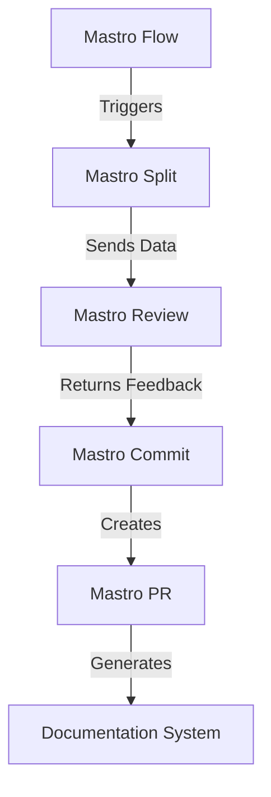
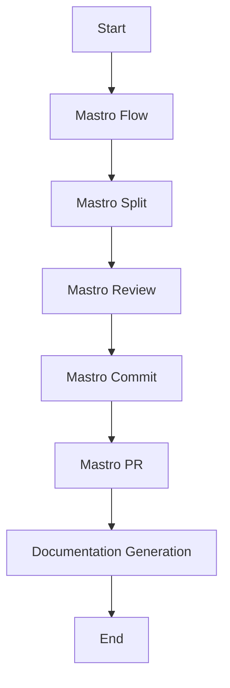
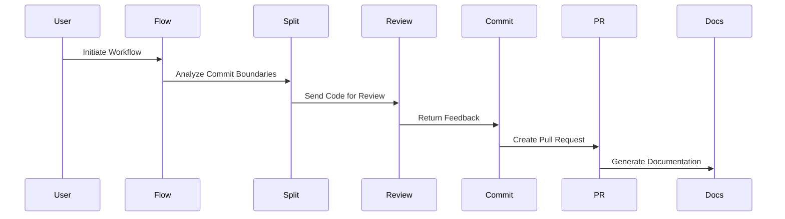

<!---
This file was automatically generated by Mastro CLI
Generated on: 2025-08-12T03:59:29.471Z
Document type: architecture
Title: Architecture Documentation
References: .claude/settings.local.json, lib/commands/config.d.ts, lib/commands/config.js, lib/utils/config.d.ts, lib/utils/config.js, refined-prompts/generative-prompt-2025-08-09T21-33-56-948Z.json, refined-prompts/generative-prompt-2025-08-09T21-38-47-439Z.json, src/commands/config.ts, src/utils/config.ts, bin/dev, bin/run, lib/index.d.ts, lib/index.js, lib/commands/brainstorm.d.ts, lib/commands/brainstorm.js, lib/commands/info.d.ts, lib/commands/info.js, lib/commands/refine.d.ts, lib/commands/refine.js

To prevent this file from being overwritten, add custom content
between the CUSTOM_START and CUSTOM_END markers below.
--->

# Refiner Architecture Documentation

## 1. High-Level System Architecture Overview

The **Refiner** project is an enterprise-level CLI tool built using TypeScript and Node.js, designed to streamline code review and workflow orchestration. The system is modular, allowing for easy extension and maintenance. The architecture is composed of several key components that interact to provide a seamless user experience.

### Key Components:
- **Mastro Flow**: Orchestrates the workflow from code splitting to analytics.
- **Mastro Review**: Provides AI-powered code reviews.
- **Mastro Split**: Analyzes commit boundaries intelligently.
- **Mastro Commit**: Generates enhanced commit messages.
- **Mastro PR**: Manages pull requests.
- **Documentation System**: Generates multi-format documentation with Mermaid diagrams.

## 2. Component Relationships and Data Flow

The components interact through a series of defined interfaces and data flows. Below is a simplified representation of the relationships:



## 3. Design Patterns and Architectural Decisions

### Design Patterns:
- **Command Pattern**: Used in the CLI commands to encapsulate all the details of an operation.
- **Observer Pattern**: Employed in the workflow orchestration to notify components of state changes.
- **Factory Pattern**: Utilized for creating instances of services and commands dynamically.

### Architectural Decisions:
- **Modularity**: Each component is designed as a separate module to enhance maintainability.
- **AI Integration**: Leveraging AI for code reviews to improve accuracy and efficiency.
- **Documentation Generation**: Built-in capabilities for generating documentation to ensure clarity and usability.

## 4. Technology Stack and Rationale

- **TypeScript**: Provides strong typing and enhances code quality.
- **Node.js**: Asynchronous, event-driven architecture suitable for I/O-heavy applications.
- **Mermaid**: For generating diagrams to visualize workflows and data flows.
- **OpenAI SDK**: For integrating AI capabilities in code review.

### Key Dependencies:
- `@anthropic-ai/sdk`
- `@oclif/core`
- `chalk`
- `dotenv`
- `inquirer`
- `openai`

## 5. Directory Structure and Organization

The project is organized into a clear directory structure to facilitate navigation and understanding:

```
refiner/
├── .claude/
├── bin/
├── docs/
├── lib/
│   ├── commands/
│   │   ├── refine/
│   ├── services/
│   ├── templates/
│   ├── ui/
│   └── utils/
├── refined-prompts/
├── src/
│   ├── commands/
│   │   ├── refine/
│   └── services/
```

## 6. Module Dependencies and Interfaces

Each module has defined interfaces to ensure clear communication between components. For example:

- **Mastro Flow** interacts with **Mastro Split** through a `Workflow` interface.
- **Mastro Review** receives input from **Mastro Split** and returns a `ReviewFeedback` object.

## 7. Data Models and Storage Architecture

Data models are defined to represent the entities within the system. Key models include:

- **Commit**: Represents a code commit with metadata.
- **ReviewFeedback**: Contains AI-generated feedback for code reviews.
- **PullRequest**: Represents a pull request with associated commits.

### Storage:
Data is primarily stored in memory during execution, with options to extend to persistent storage if needed.

## 8. Security Architecture and Considerations

Security is a critical aspect of the Refiner project. Key considerations include:

- **Input Validation**: Ensuring all inputs are validated to prevent injection attacks.
- **Sensitive Data Handling**: Using environment variables for sensitive configurations (e.g., API keys).
- **Access Control**: Implementing role-based access control for different CLI commands.

## 9. Performance and Scalability Design

The architecture is designed to handle large codebases efficiently. Key strategies include:

- **Asynchronous Processing**: Leveraging Node.js's event-driven model to handle multiple requests concurrently.
- **Caching**: Implementing caching strategies for frequently accessed data to reduce latency.

## 10. Deployment Architecture

The Refiner project can be deployed as a CLI tool on various environments. Key deployment considerations include:

- **Containerization**: Using Docker to create a consistent deployment environment.
- **CI/CD Integration**: Automating testing and deployment processes using tools like GitHub Actions.

## 11. Mermaid Diagrams for Visual Representation

### Workflow Diagram



### Component Interaction Diagram



---

This documentation serves as a comprehensive guide for both new team members and experienced developers, providing insights into the design and architecture of the Refiner project. It aims to facilitate informed decision-making regarding modifications or extensions to the system.\n\n## System Architecture\n\nHigh-level system architecture overview\n\n```mermaid\nflowchart TD\n        A[Client Application] --> B[API Gateway]\n        B --> C[Business Logic Layer]\n        C --> D[Data Access Layer]\n        D --> E[Database]\n        F[nodejs] --> C\n```\n\n\n\n## Main User Journey Flow\n\nUser flow diagram for Main User Journey\n\n```mermaid\nflowchart TD\n        A[Load Application]\n        B[Navigate]\n        A --> B\n        C[Interact]\n        B --> C\n```\n\n

---

<!-- CUSTOM_START -->
<!-- Add your custom content here - it will be preserved during regeneration -->
<!-- CUSTOM_END -->

*Documentation generated by [Mastro CLI](https://github.com/your-org/mastro) on 8/11/2025*