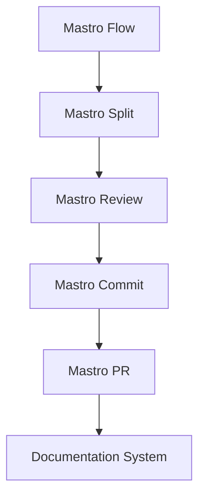
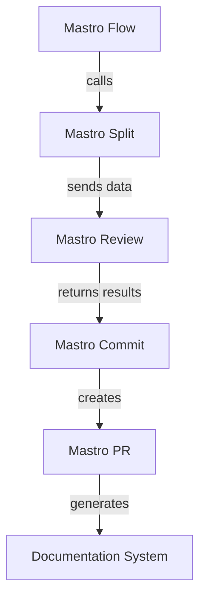
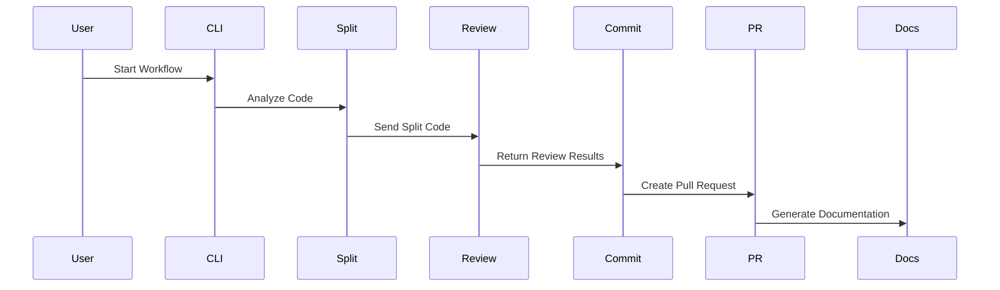

<!---
This file was automatically generated by Mastro CLI
Generated on: 2025-08-12T03:57:32.426Z
Document type: architecture
Title: Architecture Documentation
References: .claude/settings.local.json, lib/commands/config.d.ts, lib/commands/config.js, lib/utils/config.d.ts, lib/utils/config.js, refined-prompts/generative-prompt-2025-08-09T21-33-56-948Z.json, refined-prompts/generative-prompt-2025-08-09T21-38-47-439Z.json, src/commands/config.ts, src/utils/config.ts, bin/dev, bin/run, lib/index.d.ts, lib/index.js, lib/commands/brainstorm.d.ts, lib/commands/brainstorm.js, lib/commands/info.d.ts, lib/commands/info.js, lib/commands/refine.d.ts, lib/commands/refine.js

To prevent this file from being overwritten, add custom content
between the CUSTOM_START and CUSTOM_END markers below.
--->

# Refiner Architecture Documentation

## 1. High-Level System Architecture Overview

The **Refiner** project is designed as an enterprise-level CLI tool that orchestrates workflows for code review, commit management, and documentation generation. Built using TypeScript and Node.js, it integrates various components to streamline development processes, leveraging AI for enhanced code quality and efficiency.

### Key Components:
- **Mastro Flow**: Orchestrates the entire workflow from splitting code to analytics.
- **Mastro Review**: Provides AI-driven code review capabilities.
- **Mastro Split**: Analyzes commit boundaries intelligently.
- **Mastro Commit**: Generates enhanced commit messages.
- **Mastro PR**: Manages pull requests effectively.
- **Documentation System**: Generates multi-format documentation, including Mermaid diagrams.

## 2. Component Relationships and Data Flow

The components interact in a defined sequence to facilitate a smooth workflow:

1. **Mastro Flow** initiates the process.
2. **Mastro Split** analyzes the code and determines commit boundaries.
3. **Mastro Review** performs AI-powered reviews on the split code.
4. **Mastro Commit** generates commit messages based on the review.
5. **Mastro PR** creates and manages pull requests.
6. **Documentation System** generates documentation throughout the process.

### Data Flow Diagram


## 3. Design Patterns and Architectural Decisions

### Design Patterns:
- **Command Pattern**: Used in the CLI commands to encapsulate request as an object.
- **Observer Pattern**: Employed for event handling in workflow orchestration.
- **Factory Pattern**: Utilized for creating instances of various services dynamically.

### Architectural Decisions:
- **Microservices Architecture**: Each component is designed as a microservice to ensure modularity and scalability.
- **AI Integration**: Leveraging AI for code review enhances the quality and speed of the review process.

## 4. Technology Stack and Rationale

- **TypeScript**: Provides type safety and better tooling support.
- **Node.js**: Asynchronous I/O capabilities make it suitable for CLI applications.
- **Mermaid**: For generating diagrams, enhancing documentation clarity.
- **AI Libraries**: Integration with libraries like `@anthropic-ai/sdk` and `openai` for AI functionalities.

## 5. Directory Structure and Organization

The project is organized into several directories, each serving a specific purpose:

```
refiner/
├── .claude/                # Source code files
├── bin/                    # Executable files
├── docs/                   # Documentation files
├── lib/                    # Library source code
│   ├── commands/           # Command implementations
│   ├── services/           # Business logic
│   ├── templates/          # Templates for various outputs
│   ├── ui/                 # User interface components
│   └── utils/              # Utility functions
├── refined-prompts/        # Source code for refined prompts
└── src/                    # Main source code
    ├── commands/           # Command implementations
    └── services/           # Business logic
```

## 6. Module Dependencies and Interfaces

The project relies on several key dependencies, each serving a specific function:

- **@anthropic-ai/sdk**: For AI functionalities.
- **@oclif/core**: CLI framework for building command-line tools.
- **chalk**: For styling terminal output.
- **dotenv**: For environment variable management.

### Interfaces:
Each module exposes a clear interface for interaction, ensuring loose coupling and high cohesion.

## 7. Data Models and Storage Architecture

The project primarily operates in-memory for transient data. However, persistent data can be managed using JSON files or databases as needed. Key data models include:

- **Commit**: Represents a code commit with metadata.
- **Review**: Contains review comments and validation results.
- **Workflow**: Tracks the state of the workflow through various stages.

## 8. Security Architecture and Considerations

Security is paramount, especially when dealing with code and AI integrations. Key considerations include:

- **Input Validation**: Ensuring all inputs are sanitized to prevent injection attacks.
- **Environment Variables**: Sensitive data is managed through `.env` files, ensuring they are not hard-coded.
- **Access Control**: Implementing role-based access control for sensitive operations.

## 9. Performance and Scalability Design

The architecture is designed to handle high loads by:

- **Asynchronous Processing**: Utilizing Node.js's non-blocking I/O for handling multiple requests.
- **Load Balancing**: Distributing workloads across multiple instances of the CLI tool.
- **Caching**: Implementing caching strategies for frequently accessed data.

## 10. Deployment Architecture

The deployment architecture is designed for flexibility and scalability:

- **Containerization**: Using Docker for consistent deployment across environments.
- **CI/CD Pipelines**: Automated testing and deployment processes ensure rapid iterations.
- **Cloud Deployment**: Leveraging cloud services for scalability and reliability.

## 11. Mermaid Diagrams for Visual Representation

### System Architecture\n\nHigh-level system architecture overview\n\n```mermaid\nflowchart TD\n        A[Client Application] --> B[API Gateway]\n        B --> C[Business Logic Layer]\n        C --> D[Data Access Layer]\n        D --> E[Database]\n        F[nodejs] --> C\n```\n\n Diagram


### Component Interaction Diagram


---

This documentation aims to provide both new team members and experienced developers with a comprehensive understanding of the Refiner project architecture, enabling informed decisions regarding modifications or extensions.\n\n## Main User Journey Flow\n\nUser flow diagram for Main User Journey\n\n```mermaid\nflowchart TD\n        A[Load Application]\n        B[Navigate]\n        A --> B\n        C[Interact]\n        B --> C\n```\n\n

---

<!-- CUSTOM_START -->
<!-- Add your custom content here - it will be preserved during regeneration -->
<!-- CUSTOM_END -->

*Documentation generated by [Mastro CLI](https://github.com/your-org/mastro) on 8/11/2025*