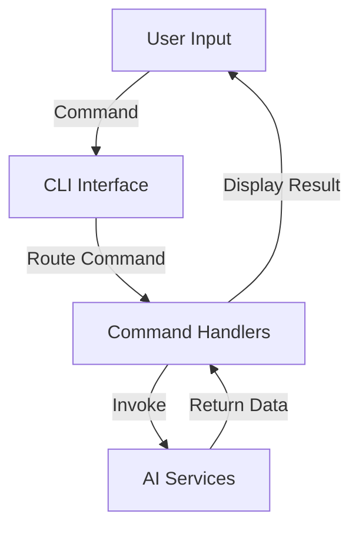
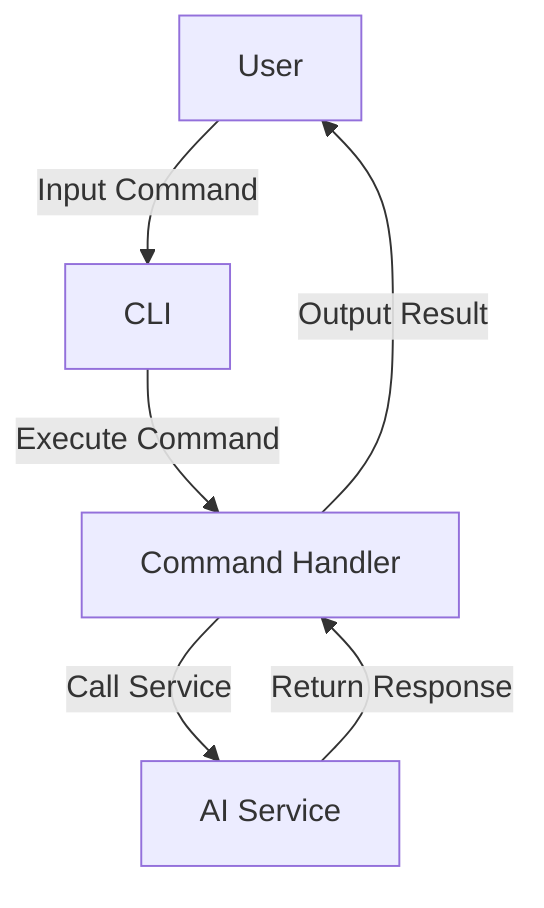
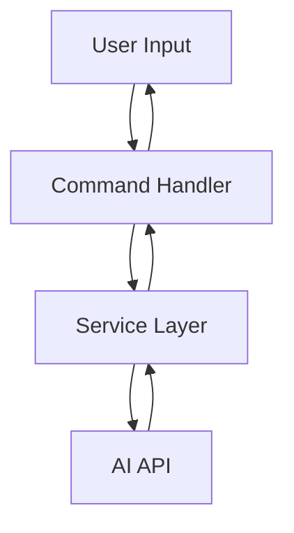

<!---
This file was automatically generated by refiner
Generated on: 2025-08-13T06:00:37.867Z
Document type: architecture
Title: Architecture Documentation
References: .claude/settings.local.json, .mastro/analytics.json, lib/commands/config.d.ts, lib/commands/config.js, lib/utils/config.d.ts, lib/utils/config.js, refined-prompts/generative-prompt-2025-08-09T21-33-56-948Z.json, refined-prompts/generative-prompt-2025-08-09T21-38-47-439Z.json, src/commands/config.ts, src/utils/config.ts, bin/dev, bin/run, lib/index.d.ts, lib/index.js, lib/commands/brainstorm.d.ts, lib/commands/brainstorm.js, lib/commands/info.d.ts, lib/commands/info.js, lib/commands/refine.d.ts, lib/commands/refine.js

To prevent this file from being overwritten, add custom content
between the CUSTOM_START and CUSTOM_END markers below.
--->

# Refiner Architecture Documentation

## 1. High-Level System Architecture Overview

The **Refiner** project is a Node.js application built with TypeScript, designed to facilitate AI-driven brainstorming and refinement processes. The architecture follows a modular design, allowing for easy extension and maintenance. The application is structured around a command-line interface (CLI) that interacts with various AI services to generate and refine content.

### Key Features:
- Modular command structure for extensibility.
- Integration with multiple AI service providers.
- User-friendly CLI for interaction.

## 2. Component Relationships and Data Flow

The application is composed of several key components that interact with each other to fulfill user commands. The primary components include:

- **Commands**: Each command (e.g., `brainstorm`, `config`, `info`, `refine`) is implemented as a separate module within the `src/commands` directory.
- **Services**: Core logic for interacting with AI services is encapsulated within the `src/services` directory.
- **CLI Interface**: The entry point of the application is `src/index.ts`, which initializes the CLI and routes commands to their respective handlers.

### Data Flow:
1. User inputs a command via the CLI.
2. The command handler processes the input and may invoke services to fetch or manipulate data.
3. Services interact with external AI APIs to perform tasks.
4. Results are returned to the command handler and displayed to the user.



## 3. Design Patterns and Architectural Decisions

The architecture employs several design patterns:

- **Command Pattern**: Each command is encapsulated in its own class, allowing for easy addition of new commands without modifying existing code.
- **Factory Pattern**: The `ai-client-factory.ts` is responsible for creating instances of AI clients based on configuration, promoting loose coupling.
- **Dependency Injection**: Services are injected into command handlers, enhancing testability and modularity.

## 4. Technology Stack and Rationale

- **Node.js**: Chosen for its non-blocking I/O capabilities, making it suitable for handling multiple API requests.
- **TypeScript**: Provides type safety and better tooling support, improving code quality and maintainability.
- **Oclif**: A framework for building CLI applications, which simplifies command management and helps in creating a robust CLI experience.
- **AI SDKs**: Various SDKs (e.g., `@anthropic-ai/sdk`, `openai`) are integrated for accessing AI capabilities.

## 5. Directory Structure and Organization

The project follows a structured directory layout to separate concerns:

```
refiner/
├── .claude/
├── .mastro/
├── bin/
├── docs/
├── lib/
│   ├── commands/
│   ├── services/
│   ├── templates/
│   ├── ui/
│   └── utils/
├── refined-prompts/
├── src/
│   ├── commands/
│   └── services/
└── package.json
```

- **src/**: Contains the main application code.
- **lib/**: Contains reusable components and utilities.
- **docs/**: Documentation files for the project.

## 6. Module Dependencies and Interfaces

The project relies on several key dependencies, which are managed via `package.json`. Each command and service module interfaces with these dependencies to perform their tasks.

### Key Dependencies:
- **@oclif/core**: Command-line framework.
- **@anthropic-ai/sdk**: AI service client.
- **dotenv**: Environment variable management.

## 7. Data Models and Storage Architecture

The application primarily interacts with external AI services for data storage and retrieval. There are no local data storage mechanisms implemented, as the focus is on real-time interaction with AI APIs.

### Data Models:
- **Prompt**: Represents the input provided by the user for brainstorming or refinement.
- **Response**: Represents the output generated by the AI service.

## 8. Security Architecture and Considerations

Security is paramount, especially when dealing with external APIs. Key considerations include:

- **Environment Variables**: Sensitive information (e.g., API keys) is stored in environment variables using `dotenv`.
- **Input Validation**: User inputs are validated to prevent injection attacks.
- **Rate Limiting**: Implemented at the API level to prevent abuse of AI services.

## 9. Performance and Scalability Design

The application is designed to handle multiple requests efficiently:

- **Asynchronous Operations**: Leveraging Node.js's asynchronous capabilities to handle multiple API calls concurrently.
- **Caching**: Future enhancements may include caching responses to reduce API calls and improve performance.

## 10. Deployment Architecture

The application can be deployed on any environment that supports Node.js. Recommended deployment strategies include:

- **Docker**: Containerizing the application for consistent deployment across environments.
- **Cloud Services**: Utilizing platforms like AWS or Azure for scalable deployment.

## 11. Mermaid Diagrams for Visual Representation

### Component Interaction Diagram



### Data Flow Diagram



---

This documentation serves as a comprehensive guide for both new team members and experienced developers, providing insights into the architecture and design of the Refiner project. It aims to facilitate informed decision-making regarding modifications or extensions to the system.\n\n## System Architecture\n\nHigh-level system architecture overview\n\n```mermaid\nflowchart TD\n        A[Client Application] --> B[API Gateway]\n        B --> C[Business Logic Layer]\n        C --> D[Data Access Layer]\n        D --> E[Database]\n        F[nodejs] --> C\n```\n\n\n\n## Main User Journey Flow\n\nUser flow diagram for Main User Journey\n\n```mermaid\nflowchart TD\n        A[Load Application]\n        B[Navigate]\n        A --> B\n        C[Interact]\n        B --> C\n```\n\n

---

<!-- CUSTOM_START -->
<!-- Add your custom content here - it will be preserved during regeneration -->
<!-- CUSTOM_END -->

*Documentation generated by refiner on 8/13/2025*