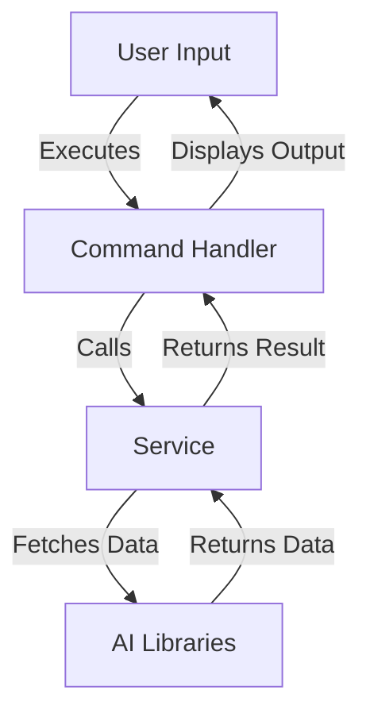

<!---
This file was automatically generated by refiner
Generated on: 2025-08-13T04:49:44.984Z
Document type: architecture
Title: Architecture Documentation
References: .claude/settings.local.json, .mastro/analytics.json, lib/commands/config.d.ts, lib/commands/config.js, lib/utils/config.d.ts, lib/utils/config.js, refined-prompts/generative-prompt-2025-08-09T21-33-56-948Z.json, refined-prompts/generative-prompt-2025-08-09T21-38-47-439Z.json, src/commands/config.ts, src/utils/config.ts, bin/dev, bin/run, lib/index.d.ts, lib/index.js, lib/commands/brainstorm.d.ts, lib/commands/brainstorm.js, lib/commands/info.d.ts, lib/commands/info.js, lib/commands/refine.d.ts, lib/commands/refine.js

To prevent this file from being overwritten, add custom content
between the CUSTOM_START and CUSTOM_END markers below.
--->

# Refiner Architecture Documentation

## 1. High-Level System Architecture Overview

The **Refiner** project is an enterprise-level application built using TypeScript and Node.js. It serves as a command-line interface (CLI) tool that leverages various AI services to facilitate brainstorming, configuration, and information retrieval. The architecture is designed to be modular, allowing for easy extension and maintenance.

### Key Features:
- Command execution via a CLI
- Integration with multiple AI services
- Configurable user settings
- User-friendly prompts and interactions

## 2. Component Relationships and Data Flow

The system is composed of several key components that interact with each other to fulfill user commands. The primary components include:

- **Commands**: Handle user input and execute specific functionalities.
- **Services**: Interact with external AI libraries and manage business logic.
- **Utilities**: Provide helper functions and configurations.

### Data Flow:
1. User inputs a command via the CLI.
2. The command handler processes the input and invokes the corresponding service.
3. The service interacts with AI libraries to fetch or process data.
4. Results are returned to the command handler, which formats and displays the output.



## 3. Design Patterns and Architectural Decisions

### Design Patterns:
- **Command Pattern**: Each command is encapsulated in its own class, allowing for easy addition of new commands.
- **Factory Pattern**: The `ai-client-factory.ts` is used to instantiate different AI clients based on configuration.
- **Singleton Pattern**: Configuration settings are loaded once and reused throughout the application.

### Architectural Decisions:
- Modular architecture to promote separation of concerns.
- Use of TypeScript for type safety and improved developer experience.
- CLI framework (`@oclif/core`) for robust command handling.

## 4. Technology Stack and Rationale

- **TypeScript**: Provides static typing, enhancing code quality and maintainability.
- **Node.js**: Asynchronous event-driven architecture suitable for I/O-bound applications.
- **@oclif/core**: A powerful CLI framework that simplifies command management.
- **AI Libraries**: Multiple libraries (e.g., OpenAI, Anthropic) are integrated to leverage various AI capabilities.

## 5. Directory Structure and Organization

The project follows a structured directory layout to enhance organization and maintainability:

```
refiner/
├── .claude/
├── .mastro/
├── bin/
├── docs/
├── lib/
│   ├── commands/
│   ├── services/
│   ├── templates/
│   ├── ui/
│   └── utils/
├── refined-prompts/
└── src/
    ├── commands/
    └── services/
```

- **src/**: Contains the main application code.
- **lib/**: Houses reusable components and utilities.
- **docs/**: Contains all documentation files.

## 6. Module Dependencies and Interfaces

The project relies on several key dependencies, each serving a specific purpose:

| Dependency                     | Purpose                                   |
|--------------------------------|-------------------------------------------|
| `@anthropic-ai/sdk`           | AI service integration                     |
| `@google/generative-ai`        | AI service integration                     |
| `@oclif/core`                 | CLI framework                             |
| `chalk`                       | Terminal string styling                   |
| `dotenv`                      | Environment variable management           |
| `inquirer`                   | Interactive command-line prompts          |

### Interfaces:
- Each service exposes a well-defined interface for interaction, ensuring loose coupling and easier testing.

## 7. Data Models and Storage Architecture

The application primarily operates in-memory and does not persist data across sessions. However, configuration settings are stored using the `conf` library, allowing for easy retrieval and updates.

### Key Data Models:
- **Configuration**: Holds user settings and preferences.
- **Command Input/Output**: Structures for handling user commands and responses.

## 8. Security Architecture and Considerations

Security is a critical aspect of the Refiner project. Key considerations include:

- **Input Validation**: All user inputs are validated to prevent injection attacks.
- **Environment Variables**: Sensitive information is managed using `.env` files and the `dotenv` library.
- **Dependency Management**: Regular updates and audits of dependencies to mitigate vulnerabilities.

## 9. Performance and Scalability Design

The architecture is designed for performance and scalability:

- **Asynchronous Processing**: Leveraging Node.js's non-blocking I/O for efficient command execution.
- **Modular Components**: Allows for independent scaling of services as needed.
- **Caching Strategies**: Future enhancements may include caching frequently accessed data to reduce latency.

## 10. Deployment Architecture

The Refiner project can be deployed in various environments, including local machines and cloud platforms. Key deployment considerations include:

- **Containerization**: Using Docker for consistent deployment across environments.
- **CI/CD Pipelines**: Automated testing and deployment processes to ensure code quality and reliability.

## Conclusion

This architecture documentation provides a comprehensive overview of the Refiner project, aimed at both new team members and experienced developers. By understanding the system design, team members can make informed decisions regarding modifications and extensions, ensuring the continued success of the project.\n\n## System Architecture\n\nHigh-level system architecture overview\n\n```mermaid\nflowchart TD\n        A[Client Application] --> B[API Gateway]\n        B --> C[Business Logic Layer]\n        C --> D[Data Access Layer]\n        D --> E[Database]\n        F[nodejs] --> C\n```\n\n\n\n## Main User Journey Flow\n\nUser flow diagram for Main User Journey\n\n```mermaid\nflowchart TD\n        A[Load Application]\n        B[Navigate]\n        A --> B\n        C[Interact]\n        B --> C\n```\n\n

---

<!-- CUSTOM_START -->
<!-- Add your custom content here - it will be preserved during regeneration -->
<!-- CUSTOM_END -->

*Documentation generated by refiner on 8/13/2025*