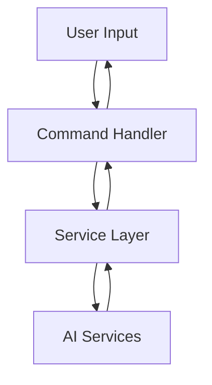
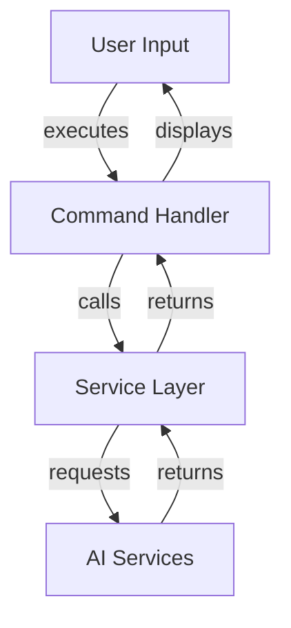
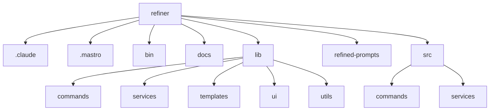

<!---
This file was automatically generated by refiner
Generated on: 2025-08-13T05:56:22.633Z
Document type: architecture
Title: Architecture Documentation
References: .claude/settings.local.json, .mastro/analytics.json, lib/commands/config.d.ts, lib/commands/config.js, lib/utils/config.d.ts, lib/utils/config.js, refined-prompts/generative-prompt-2025-08-09T21-33-56-948Z.json, refined-prompts/generative-prompt-2025-08-09T21-38-47-439Z.json, src/commands/config.ts, src/utils/config.ts, bin/dev, bin/run, lib/index.d.ts, lib/index.js, lib/commands/brainstorm.d.ts, lib/commands/brainstorm.js, lib/commands/info.d.ts, lib/commands/info.js, lib/commands/refine.d.ts, lib/commands/refine.js

To prevent this file from being overwritten, add custom content
between the CUSTOM_START and CUSTOM_END markers below.
--->

# Refiner Architecture Documentation

## 1. High-Level System Architecture Overview

The **Refiner** project is an enterprise-level application built using TypeScript and Node.js. It serves as a command-line interface (CLI) tool that leverages various AI services to facilitate brainstorming, configuration, and information retrieval. The architecture is modular, allowing for easy extension and maintenance.

### Key Features:
- Command execution via Oclif framework
- Integration with multiple AI services
- User-friendly CLI with interactive prompts

## 2. Component Relationships and Data Flow

The system is composed of several key components that interact to fulfill user commands. Below is a simplified data flow:

1. **User Input**: The user invokes a command via the CLI.
2. **Command Handler**: The command is routed to the appropriate handler (e.g., `brainstorm.ts`, `config.ts`).
3. **Service Layer**: The command handler interacts with the service layer (e.g., `ai-client.ts`, `brainstormer.ts`) to perform the necessary operations.
4. **AI Services**: The service layer communicates with external AI libraries (e.g., OpenAI, Anthropic) to process requests.
5. **Output**: The results are returned to the user via the CLI.



## 3. Design Patterns and Architectural Decisions

### Design Patterns:
- **Command Pattern**: Each command is encapsulated in its own module, allowing for easy addition of new commands.
- **Factory Pattern**: The `ai-client-factory.ts` creates instances of AI clients based on configuration, promoting loose coupling.

### Architectural Decisions:
- **Modular Architecture**: Each command and service is separated into distinct files for clarity and maintainability.
- **Dependency Injection**: Services are injected into command handlers to facilitate testing and reduce coupling.

## 4. Technology Stack and Rationale

- **TypeScript**: Provides type safety and modern JavaScript features.
- **Node.js**: Asynchronous, event-driven architecture suitable for I/O-bound applications.
- **Oclif**: A framework for building CLI applications, enabling easy command management.
- **AI SDKs**: Integration with various AI services (OpenAI, Anthropic) to leverage advanced capabilities.

## 5. Directory Structure and Organization

The project follows a structured directory layout to enhance navigability:

```
refiner/
├── .claude/
├── .mastro/
├── bin/
├── docs/
├── lib/
│   ├── commands/
│   ├── services/
│   ├── templates/
│   ├── ui/
│   └── utils/
├── refined-prompts/
└── src/
    ├── commands/
    └── services/
```

- **src/**: Contains the main source code.
- **lib/**: Contains reusable libraries and utilities.
- **docs/**: Contains documentation files.

## 6. Module Dependencies and Interfaces

### Key Dependencies:
- `@anthropic-ai/sdk`
- `@google/generative-ai`
- `@oclif/core`
- `chalk`
- `dotenv`

### Interfaces:
- Each command module exports a consistent interface for command execution, ensuring uniformity across the application.

## 7. Data Models and Storage Architecture

The application primarily interacts with external AI services, thus it does not maintain a local database. However, configurations and user preferences are stored using the `conf` library, which provides a simple key-value store.

### Configuration Model:
```typescript
interface Config {
    apiKey: string;
    userPreferences: Record<string, any>;
}
```

## 8. Security Architecture and Considerations

- **Environment Variables**: Sensitive information (e.g., API keys) is managed through environment variables using the `dotenv` package.
- **Input Validation**: User inputs are validated to prevent injection attacks and ensure data integrity.

## 9. Performance and Scalability Design

- **Asynchronous Processing**: Leveraging Node.js's asynchronous capabilities to handle multiple requests concurrently.
- **Caching**: Implement caching strategies for frequently accessed data to reduce latency and improve performance.

## 10. Deployment Architecture

The application can be deployed on any Node.js-compatible environment. Recommended deployment strategies include:

- **Docker**: Containerization for consistent environments across development and production.
- **CI/CD Pipelines**: Automated testing and deployment using platforms like GitHub Actions or Jenkins.

## 11. Mermaid Diagrams for Visual Representation

### Component Interaction Diagram


### Directory Structure Diagram


---

This documentation serves as a comprehensive guide for both new team members and experienced developers, providing insights into the architecture, design decisions, and operational considerations of the Refiner project.\n\n## System Architecture\n\nHigh-level system architecture overview\n\n```mermaid\nflowchart TD\n        A[Client Application] --> B[API Gateway]\n        B --> C[Business Logic Layer]\n        C --> D[Data Access Layer]\n        D --> E[Database]\n        F[nodejs] --> C\n```\n\n\n\n## Main User Journey Flow\n\nUser flow diagram for Main User Journey\n\n```mermaid\nflowchart TD\n        A[Load Application]\n        B[Navigate]\n        A --> B\n        C[Interact]\n        B --> C\n```\n\n

---

<!-- CUSTOM_START -->
<!-- Add your custom content here - it will be preserved during regeneration -->
<!-- CUSTOM_END -->

*Documentation generated by refiner on 8/13/2025*